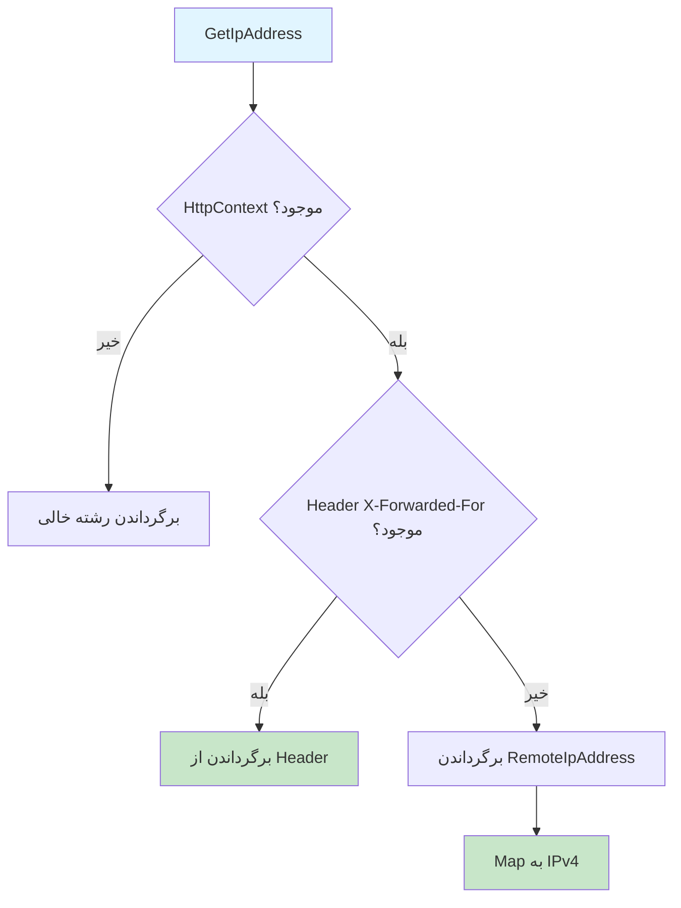

# IpAddressService.cs

**مسیر**: `Csis.Admission.Services/IpAddressService.cs`

## 1. هدف (Purpose)

این سرویس برای **دریافت IP Address کاربر** از HTTP Request استفاده می‌شود.

### کاربرد اصلی:
- دریافت IP کاربر برای Audit Logging
- Security Logging
- ردیابی محل دسترسی
- جلوگیری از سوء استفاده

---

## 2. Interface

```csharp
public interface IIpAddressService
{
    string GetIpAddress();
}
```

---

## 3. متد اصلی

### GetIpAddress()

**هدف**: دریافت IP Address کاربر از HTTP Context

#### خروجی:
```csharp
string // IP Address (یا رشته خالی اگر HttpContext موجود نباشد)
```

#### منطق:


---

## 4. نکات مهم

### X-Forwarded-For Header
```csharp
if (contextAccessor.HttpContext.Request.Headers.TryGetValue("X-Forwarded-For", out var value)) 
{
    return value; // IP واقعی پشت Proxy/Load Balancer
}
```

**کاربرد**: در صورت استفاده از Reverse Proxy یا Load Balancer، IP واقعی کاربر در این Header قرار دارد.

### Fallback به RemoteIpAddress
```csharp
return contextAccessor.HttpContext.Connection.RemoteIpAddress.MapToIPv4().ToString();
```

**کاربرد**: اگر X-Forwarded-For موجود نباشد، از `RemoteIpAddress` استفاده می‌شود.

---

## 5. وابستگی‌ها (Dependencies)

**Dependencies تزریق شده:**
1. **IServiceProvider**: برای دریافت `IHttpContextAccessor`

**چرا ServiceProvider؟**
- `IHttpContextAccessor` در Scoped یا Singleton ممکن است موجود نباشد
- استفاده از ServiceProvider انعطاف‌پذیری بیشتری فراهم می‌کند

---

## 6. الگوهای طراحی (Design Patterns)

1. **Service Layer Pattern**
2. **Service Locator Pattern**: استفاده از `IServiceProvider`
3. **Primary Constructor** (C# 12)
4. **Null Object Pattern**: برگرداندن رشته خالی به جای null

---

## 7. مثال استفاده (Usage Example)

### در Command Handler برای Audit:
```csharp
internal class CreateStudentCommandHandler : IRequestHandler<CreateStudentCommand, int>
{
    private readonly IIpAddressService _ipAddressService;
    
    public async Task<int> Handle(CreateStudentCommand request, CancellationToken ct)
    {
        var student = new Student
        {
            // ...
            CreatedByIp = _ipAddressService.GetIpAddress()
        };
        
        await _repo.AddAsync(student);
        return student.Id;
    }
}
```

### در Middleware برای Logging:
```csharp
public async Task InvokeAsync(HttpContext context)
{
    var ipAddress = _ipAddressService.GetIpAddress();
    _logger.LogInformation("Request from IP: {IpAddress}", ipAddress);
    
    await _next(context);
}
```

---

## 8. Use Cases مرتبط

- **Audit Logging**: ثبت IP در تمام تغییرات
- **Security**: شناسایی دسترسی‌های مشکوک
- **Analytics**: آمار جغرافیایی کاربران
- **Rate Limiting**: محدودسازی بر اساس IP

---

## 9. نکات امنیتی (Security Considerations)

### ⚠️ **توجه به X-Forwarded-For:**
```csharp
// ⚠️ این Header می‌تواند جعلی باشد
if (contextAccessor.HttpContext.Request.Headers.TryGetValue("X-Forwarded-For", out var value)) 
{
    return value;
}
```

**مشکل**: کاربر مخرب می‌تواند X-Forwarded-For را جعل کند.

**راه‌حل**:
- اطمینان از صحت Reverse Proxy Configuration
- اعتبارسنجی IP Address
- استفاده از لیست معتبر Proxy ها

---

## نتیجه‌گیری

این سرویس یک **Utility Service** ساده برای دریافت IP کاربر است.

### نقاط قوت:
✅ پشتیبانی از X-Forwarded-For (Proxy/Load Balancer)  
✅ Fallback به RemoteIpAddress  
✅ Map به IPv4  
✅ Null-Safe (برگرداندن رشته خالی)  
✅ Primary Constructor (C# 12)  

### نکات:
⚠️ اعتبارسنجی X-Forwarded-For در Production  
⚠️ توجه به IPv6
