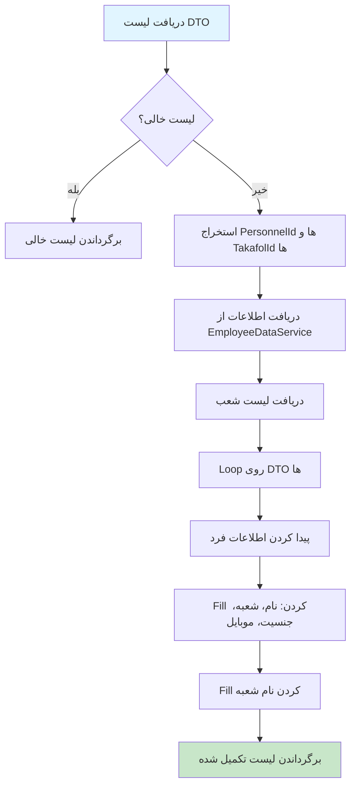

# PersonInfoService.cs

**مسیر**: `Csis.Admission.Services/PersonInfoService.cs`

## 1. هدف (Purpose)

این سرویس برای **تکمیل اطلاعات افراد** (کارمندان و افراد تحت تکفل) در DTO ها استفاده می‌شود. این سرویس اطلاعات شخصی مانند نام، نام خانوادگی، شعبه، جنسیت و موبایل را از سرویس‌های داده دریافت کرده و در DTO ها قرار می‌دهد.

### کاربرد اصلی:
- تکمیل خودکار اطلاعات کارمندان در لیست‌ها و گزارش‌ها
- Populate کردن نام، نام خانوادگی، شعبه در DTO ها
- پشتیبانی از Paging
- تکمیل اطلاعات افراد تحت تکفل

---

## 2. Interface

```csharp
public interface IPersonInfoService
{
    Task<List<TDto>> FillEmployeeInfoAsync<TDto>(List<TDto> dtoList) where TDto : IEmployeeInfoDto;
    Task<IPagedList<TDto>> FillEmployeeInfoAsync<TDto>(IPagedList<TDto> pagedList) where TDto : IEmployeeInfoDto;
    Task<TDto> FillEmployeeInfoAsync<TDto>(TDto dto) where TDto : IEmployeeInfoDto;
    Task<List<TDto>> FillEmployeeAbstractInfoAsync<TDto>(List<TDto> dtoList) where TDto : IEmployeeAbstractInfoDto;
    // ... سایر متدها
}
```

---

## 3. متدهای اصلی

### 3.1. FillEmployeeInfoAsync (لیست)

**هدف**: تکمیل اطلاعات کارمندان در یک لیست از DTO ها

#### ورودی:
| پارامتر | نوع | توضیحات |
|---------|-----|---------|
| `dtoList` | `List<TDto>` | لیست DTO هایی که باید اطلاعات آن‌ها تکمیل شود |

#### TDto Constraint:
```csharp
where TDto : IEmployeeInfoDto
```

**IEmployeeInfoDto** شامل:
- `PersonnelId` - شناسه پرسنلی
- `TakafolId` - شناسه تکفل (برای افراد تحت تکفل)
- `FirstName`, `LastName` - نام و نام خانوادگی
- `BranchId`, `BranchName` - شعبه
- `Gender`, `GenderTitle` - جنسیت
- `NationalId` - کد ملی
- `Mobile` - موبایل
- `Relation` - نسبت (برای افراد تحت تکفل)

#### مراحل اجرا:


---

### 3.2. FillEmployeeInfoAsync (PagedList)

**هدف**: تکمیل اطلاعات کارمندان در یک PagedList

#### ویژگی:
- حفظ اطلاعات Paging (PageIndex, PageSize, TotalCount)
- تکمیل اطلاعات تمام آیتم‌های صفحه جاری

---

### 3.3. FillEmployeeInfoAsync (تکی)

**هدف**: تکمیل اطلاعات یک DTO

#### پیاده‌سازی:
```csharp
public async Task<TDto> FillEmployeeInfoAsync<TDto>(TDto dto) where TDto : IEmployeeInfoDto 
{
    return (await FillEmployeeInfoAsync([dto])).FirstOrDefault();
}
```

---

### 3.4. FillEmployeeAbstractInfoAsync

**هدف**: تکمیل اطلاعات خلاصه کارمندان (بدون برخی جزئیات)

#### TDto Constraint:
```csharp
where TDto : IEmployeeAbstractInfoDto
```

**تفاوت با IEmployeeInfoDto**: فیلدهای کمتر (Abstract)

---

## 4. وابستگی‌ها (Dependencies)

**Dependencies تزریق شده:**
1. **IStudentDataService**: دریافت لیست شعب
2. **IEmployeeDataService**: دریافت اطلاعات کارمندان و افراد تحت تکفل
3. **ICsisAuthorizationService**: سرویس احراز هویت
4. **ILogger**: Logging

---

## 5. الگوهای طراحی (Design Patterns)

1. **Service Layer Pattern**: لایه سرویس برای منطق کسب‌وکار
2. **DTO Enrichment Pattern**: تکمیل خودکار DTO ها
3. **Primary Constructor** (C# 12)
4. **Generic Method Pattern**: پشتیبانی از انواع مختلف DTO

---

## 6. عملکرد و بهینه‌سازی (Performance)

### ✅ **مزایا:**
1. **Bulk Loading**: دریافت اطلاعات تمام افراد در یک Query
2. **Efficient Matching**: استفاده از LINQ برای Match کردن

### ⚠️ **نکات:**
```csharp
// دریافت اطلاعات افراد به صورت Bulk
var people = await employeeDataService.GetEmployeesAndDependantsGroupInfoAsync(codmList, takafolIds);

// دریافت شعب (احتمالاً باید Cache شود)
var branches = await studentDataService.GetCsisBranchesAsync() ?? [];
```

### پیشنهاد بهبود:
```csharp
// Cache کردن لیست شعب (نادراً تغییر می‌کنند)
var branches = await _cache.GetOrCreateAsync("branches_all", async entry => 
{
    entry.AbsoluteExpirationRelativeToNow = TimeSpan.FromHours(24);
    return await studentDataService.GetCsisBranchesAsync() ?? [];
});
```

---

## 7. مثال استفاده (Usage Example)

### در Query Handler:
```csharp
internal class GetRequestsQueryHandler : IRequestHandler<GetRequestsQuery, RequestDto[]>
{
    private readonly IRepository<Request> _repo;
    private readonly IPersonInfoService _personInfoService;
    
    public async Task<RequestDto[]> Handle(GetRequestsQuery request, CancellationToken ct)
    {
        // دریافت درخواست‌ها از DB
        var requests = await _repo.GetAllAsync<RequestDto>();
        
        // تکمیل اطلاعات کارمندان (نام، شعبه، ...)
        var enrichedRequests = await _personInfoService.FillEmployeeInfoAsync(requests.ToList());
        
        return enrichedRequests.ToArray();
    }
}
```

### با PagedList:
```csharp
public async Task<IPagedList<RequestDto>> Handle(GetPagedRequestsQuery request, CancellationToken ct)
{
    // دریافت درخواست‌ها با Paging
    var pagedRequests = await _repo.GetPagedAsync<RequestDto>(request.PageIndex, request.PageSize);
    
    // تکمیل اطلاعات (Paging حفظ می‌شود)
    var enriched = await _personInfoService.FillEmployeeInfoAsync(pagedRequests);
    
    return enriched;
}
```

---

## 8. نکات مهم

### ⚠️ **منطق TakafolId:**
```csharp
// افراد بدون تکفل: TakafolId = null یا 0
var codmList = dtoList.Where(x => !x.TakafolId.HasValue || x.TakafolId.Value == 0)
    .Select(x => x.PersonnelId);

// افراد تحت تکفل: TakafolId > 0
var takafolIds = dtoList.Where(x => x.TakafolId.HasValue && x.TakafolId.Value > 0)
    .Select(x => x.TakafolId.Value);
```

### ✅ **Relation:**
```csharp
// اگر Relation خالی باشد، "سرپرست" قرار می‌دهد
dto.Relation = person.Relation.HasValue() ? person.Relation : "سرپرست";
```

---

## 9. Use Cases مرتبط

این سرویس در Query های زیر استفاده می‌شود:
- لیست درخواست‌ها
- لیست گزارش‌ها
- جستجوی کارمندان
- هر جایی که نیاز به نمایش اطلاعات کارمندان است

---

## نتیجه‌گیری

این سرویس یک **DTO Enrichment Service** است که به صورت خودکار اطلاعات شخصی را در DTO ها قرار می‌دهد.

### نقاط قوت:
✅ Bulk Loading برای Performance  
✅ پشتیبانی از Paging  
✅ پشتیبانی از افراد تحت تکفل  
✅ Generic برای انواع DTO  

### پیشنهادات:
⚠️ Cache کردن لیست شعب  
⚠️ افزودن Logging  
