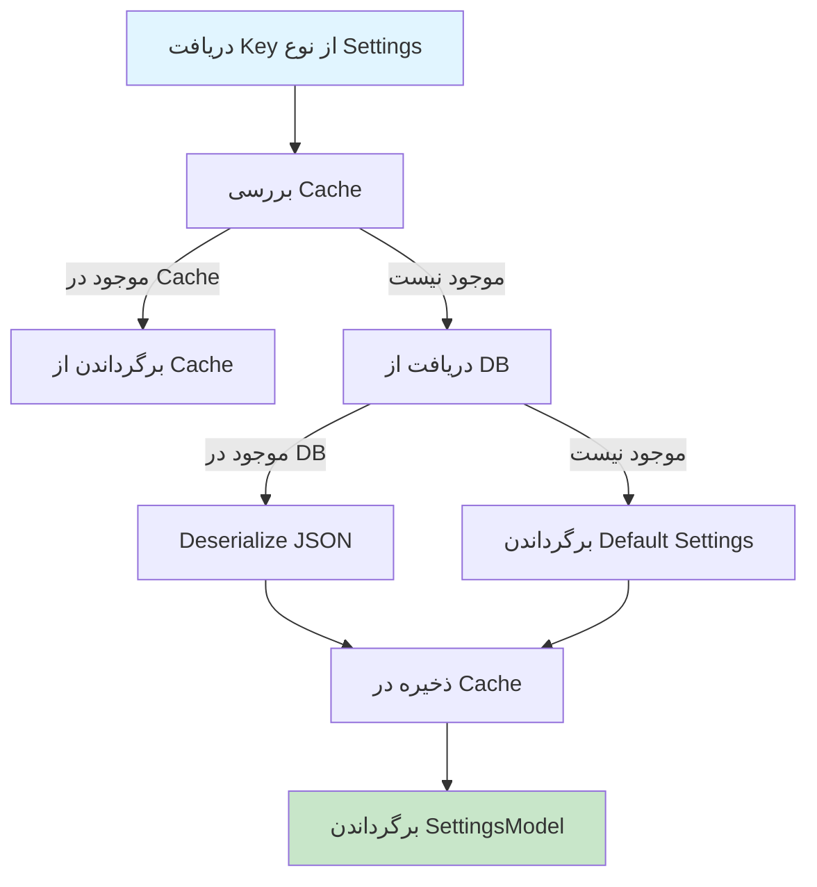
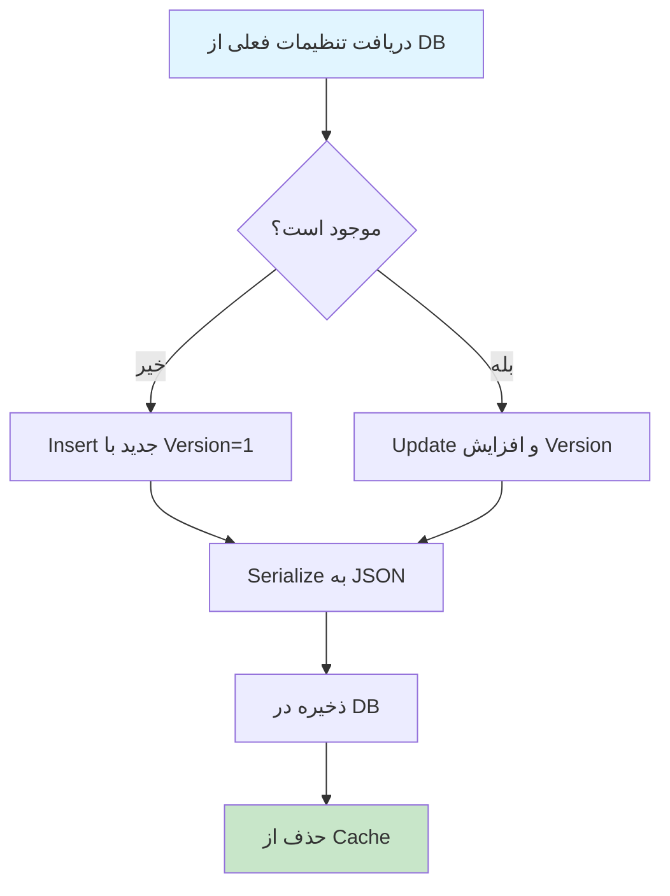

# SettingsService.cs

**مسیر**: `Csis.Admission.Services/SettingsService.cs`

## 1. هدف (Purpose)

این سرویس برای **مدیریت تنظیمات سیستم** استفاده می‌شود. تنظیمات به صورت JSON در دیتابیس ذخیره شده و با Caching بهینه می‌شوند.

### کاربرد اصلی:
- ذخیره و بازیابی تنظیمات سیستم
- پشتیبانی از Generic Settings Classes
- Caching خودکار تنظیمات
- Versioning تنظیمات
- پشتیبانی از Settings با Key Suffix (برای تنظیمات چند نمونه‌ای)

---

## 2. Interface

```csharp
public interface ISettingsService
{
    Task<SettingsModel<TSettings>> GetAsync<TSettings>() where TSettings : ISettings<TSettings>, new();
    Task<SettingsModel<TSettings>> GetAsync<TSettings>(string keySuffix) where TSettings : ISettings<TSettings>, new();
    Task SaveAsync<TSettings>(TSettings value) where TSettings : ISettings<TSettings>, new();
    Task SaveAsync<TSettings>(string keySuffix, TSettings value) where TSettings : ISettings<TSettings>, new();
}
```

---

## 3. متدهای اصلی

### 3.1. GetAsync<TSettings>()

**هدف**: دریافت تنظیمات بدون Key Suffix

#### خروجی:
```csharp
Task<SettingsModel<TSettings>>
```

**SettingsModel** شامل:
- `Value`: مقدار تنظیمات (نوع `TSettings`)
- `Version`: نسخه تنظیمات (برای Optimistic Concurrency)

#### مراحل اجرا:


#### کد:
```csharp
public async Task<SettingsModel<TSettings>> GetAsync<TSettings>() 
    where TSettings : ISettings<TSettings>, new() 
{
    var key = GetDbSettingsKey<TSettings>(null);

    return await cache.GetOrSetAsync(GetCacheKey(key), async () => 
    {
        var settings = await GetSettingsAsync<TSettings>(key);

        if (settings is null) 
        {
            return new SettingsModel<TSettings>(new TSettings().GetDefault(), 1);
        }

        return new SettingsModel<TSettings>(
            JsonSerializer.Deserialize<TSettings>(settings.Value, _serializerOptions), 
            settings.Version
        );
    });
}
```

---

### 3.2. GetAsync<TSettings>(keySuffix)

**هدف**: دریافت تنظیمات با Key Suffix

#### ورودی:
| پارامتر | نوع | توضیحات |
|---------|-----|---------|
| `keySuffix` | `string` | پسوند کلید برای تمایز تنظیمات (مثل UserId) |

#### کاربرد:
```csharp
// تنظیمات عمومی
var globalSettings = await _settingsService.GetAsync<NotificationSettings>();

// تنظیمات خاص کاربر
var userSettings = await _settingsService.GetAsync<NotificationSettings>($"User_{userId}");
```

---

### 3.3. SaveAsync<TSettings>(value)

**هدف**: ذخیره تنظیمات بدون Key Suffix

#### مراحل:


#### کد:
```csharp
public async Task SaveAsync<TSettings>(TSettings value) 
    where TSettings : ISettings<TSettings>, new() 
{
    var key = GetDbSettingsKey<TSettings>(null);
    value ??= new TSettings().GetDefault();

    var currentSettings = await GetSettingsAsync<TSettings>(key, asTracking: true);
    var json = JsonSerializer.Serialize(value, _serializerOptions);

    if (currentSettings is null) 
    {
        await settingsRepo.InsertAsync(new Setting {
            Key = key,
            Value = json,
            Version = 1
        });
    } 
    else 
    {
        currentSettings.Value = json;
        currentSettings.Version++; // افزایش Version
        await settingsRepo.UpdateAsync(currentSettings);
    }

    cache.Remove(GetCacheKey(key)); // Invalidate Cache
}
```

---

### 3.4. SaveAsync<TSettings>(keySuffix, value)

**هدف**: ذخیره تنظیمات با Key Suffix

---

## 4. ویژگی‌های کلیدی

### 4.1. Generic Type Constraints
```csharp
where TSettings : ISettings<TSettings>, new()
```
- **ISettings<TSettings>**: تنظیمات باید متد `GetDefault()` داشته باشند
- **new()**: امکان ایجاد نمونه پیش‌فرض

---

### 4.2. Versioning
```csharp
public class SettingsModel<TSettings>
{
    public TSettings Value { get; set; }
    public int Version { get; set; } // برای Optimistic Concurrency
}
```

**کاربرد**: جلوگیری از Lost Update Problem

---

### 4.3. Caching Strategy
```csharp
return await cache.GetOrSetAsync(GetCacheKey(key), async () => {
    // دریافت از DB
});
```

**مزایا**:
- کاهش Query به DB
- افزایش Performance
- Invalidation خودکار بعد از Save

---

### 4.4. Default Settings
```csharp
if (settings is null) 
{
    return new SettingsModel<TSettings>(new TSettings().GetDefault(), 1);
}
```

اگر تنظیمات در DB نباشند، مقادیر پیش‌فرض برگردانده می‌شوند.

---

## 5. وابستگی‌ها (Dependencies)

**Dependencies تزریق شده:**
1. **ISettingRepository**: دسترسی به جدول Settings در DB
2. **IMemoryCacheService**: Caching تنظیمات

---

## 6. الگوهای طراحی (Design Patterns)

1. **Generic Service Pattern**: پشتیبانی از انواع مختلف Settings
2. **Repository Pattern**: دسترسی به داده
3. **Cache-Aside Pattern**: دریافت از Cache، در صورت عدم وجود از DB
4. **Primary Constructor** (C# 12)
5. **Versioning Pattern**: Optimistic Concurrency Control

---

## 7. مثال استفاده (Usage Example)

### تعریف Settings Class:
```csharp
public class NotificationSettings : ISettings<NotificationSettings>
{
    public bool EmailEnabled { get; set; }
    public bool SmsEnabled { get; set; }
    public string[] Recipients { get; set; }

    public NotificationSettings GetDefault()
    {
        return new NotificationSettings
        {
            EmailEnabled = true,
            SmsEnabled = false,
            Recipients = Array.Empty<string>()
        };
    }
}
```

### دریافت تنظیمات:
```csharp
var settings = await _settingsService.GetAsync<NotificationSettings>();
if (settings.Value.EmailEnabled)
{
    // ارسال ایمیل
}
```

### ذخیره تنظیمات:
```csharp
var newSettings = new NotificationSettings
{
    EmailEnabled = true,
    SmsEnabled = true,
    Recipients = new[] { "admin@example.com" }
};

await _settingsService.SaveAsync(newSettings);
```

### تنظیمات خاص کاربر:
```csharp
// دریافت
var userSettings = await _settingsService.GetAsync<NotificationSettings>($"User_{userId}");

// ذخیره
await _settingsService.SaveAsync($"User_{userId}", userSettings.Value);
```

---

## 8. نکات مهم

### ⚠️ **JSON Serialization:**
```csharp
private static readonly JsonSerializerOptions _serializerOptions = new() 
{
    PropertyNamingPolicy = JsonNamingPolicy.CamelCase,
    MaxDepth = 32
};
```

**تنظیمات**:
- `CamelCase`: نام‌گذاری camelCase برای JSON
- `MaxDepth`: حداکثر عمق 32 برای جلوگیری از Circular Reference

---

### ✅ **Cache Invalidation:**
```csharp
cache.Remove(GetCacheKey(key)); // بعد از Save
```

**مهم**: همیشه بعد از ذخیره، Cache باید Invalidate شود.

---

## 9. Use Cases مرتبط

- تنظیمات اعلان‌ها
- تنظیمات کاربر
- تنظیمات سیستم
- تنظیمات گزارش‌گیری

---

## نتیجه‌گیری

این سرویس یک **Generic Settings Management Service** است که تنظیمات را به صورت JSON در DB ذخیره کرده و با Caching بهینه می‌کند.

### نقاط قوت:
✅ Generic برای انواع Settings  
✅ Caching خودکار  
✅ Versioning برای Concurrency  
✅ پشتیبانی از Default Values  
✅ پشتیبانی از Key Suffix  
✅ Primary Constructor (C# 12)  

### نقاط ضعف:
⚠️ فقدان Logging  
⚠️ فقدان Exception Handling در سطح سرویس  

### توصیه‌ها:
1. افزودن Logging برای تغییرات تنظیمات
2. افزودن Validation برای مقادیر تنظیمات
