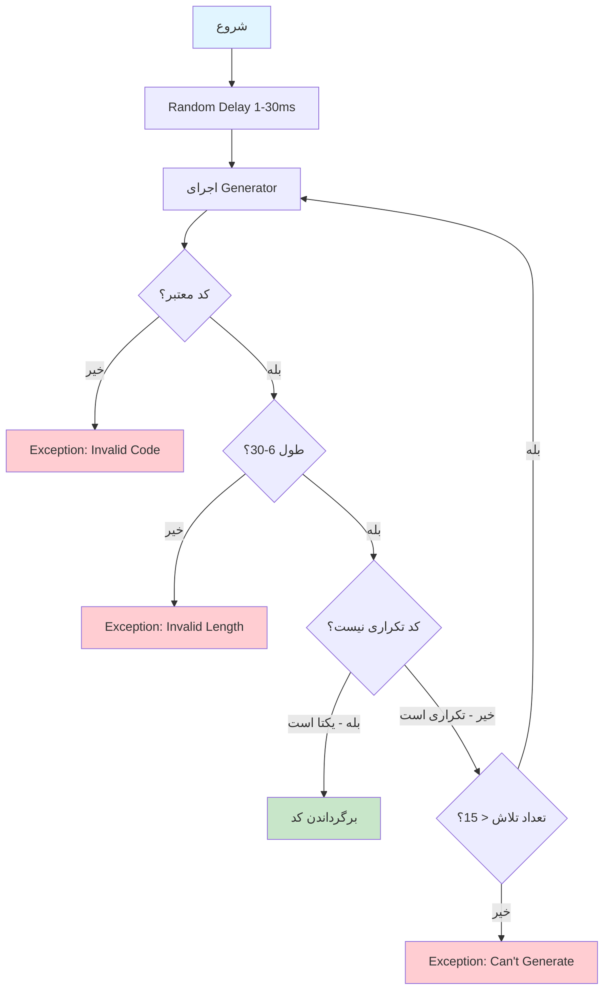

# TrackingCodeService.cs

**مسیر**: `Csis.Admission.Services/TrackingCodeService.cs`

## 1. هدف (Purpose)

این سرویس **Generic** برای **تولید کد رهگیری یکتا** برای Entities استفاده می‌شود. این سرویس اطمینان می‌دهد که کد رهگیری تولید شده تکراری نباشد.

### کاربرد اصلی:
- تولید کد رهگیری یکتا برای پرونده‌ها
- تولید کد رهگیری برای درخواست‌ها
- تولید کد پیگیری برای تراکنش‌ها
- اطمینان از یکتا بودن کد در دیتابیس

---

## 2. Interface

```csharp
public interface ITrackingCodeService<TEntity> where TEntity : class, IEntity, ITrackableEntity
{
    Task<string> GetTrackingCodeAsync(Func<string> generator, CancellationToken cancellationToken = default);
    Task<string> GetRandomTrackingCodeAsync(int codeLength = 8, CancellationToken cancellationToken = default);
    Task<string> GetTimeBasedTrackingCodeAsync(CancellationToken cancellationToken = default);
}
```

### Constraints:
```csharp
where TEntity : class, IEntity, ITrackableEntity
```
- **IEntity**: Entity باید شناسه داشته باشد
- **ITrackableEntity**: Entity باید property `TrackingCode` داشته باشد

---

## 3. متدها (Methods)

### 3.1. GetTrackingCodeAsync

**هدف**: تولید کد رهگیری با استفاده از یک Generator دلخواه

#### ورودی:
| پارامتر | نوع | اجباری | توضیحات |
|---------|-----|--------|---------|
| `generator` | `Func<string>` | بله | تابعی که کد رهگیری را تولید می‌کند |
| `cancellationToken` | `CancellationToken` | خیر | توکن کنسل کردن |

#### خروجی:
```csharp
Task<string> // کد رهگیری یکتا
```

#### مراحل اجرا:


#### Business Rules:
- **BR-1**: کد رهگیری نباید null یا خالی باشد
- **BR-2**: طول کد باید بین 6 تا 30 کاراکتر باشد
- **BR-3**: کد نباید در دیتابیس تکراری باشد
- **BR-4**: حداکثر 15 بار تلاش برای تولید کد یکتا

#### کد:
```csharp
public async Task<string> GetTrackingCodeAsync(Func<string> generator, CancellationToken cancellationToken = default) 
{
    ArgumentNullException.ThrowIfNull(generator);

    // تاخیر تصادفی برای کاهش احتمال تداخل در Concurrent Requests
    await Task.Delay(Random.Shared.Next(1, 30), cancellationToken);

    var trackingCode = string.Empty;
    var triesCount = 0;

    while (true) 
    {
        // تولید کد رهگیری
        trackingCode = generator()?.Trim();

        // اعتبارسنجی‌ها
        if (string.IsNullOrWhiteSpace(trackingCode)) 
            throw new Exception("Invalid code generated by generator");
        
        if (trackingCode.Length < 6) 
            throw new Exception("Minimum length for tracking code is 6.");
        
        if (trackingCode.Length > 30) 
            throw new Exception("Maximum length for tracking code is 30.");

        // بررسی تکراری نبودن
        if (!await repo.ExistsAsync(x => x.TrackingCode == trackingCode, cancellationToken: cancellationToken)) 
        {
            break; // کد یکتا است
        }

        triesCount++;

        if (triesCount >= MaximumTriesCount) 
            throw new Exception("Can't generate unique tracking code. Try again later");
    }

    return trackingCode;
}
```

---

### 3.2. GetRandomTrackingCodeAsync

**هدف**: تولید کد رهگیری تصادفی عددی

#### ورودی:
| پارامتر | نوع | پیش‌فرض | توضیحات |
|---------|-----|---------|---------|
| `codeLength` | `int` | 8 | طول کد رهگیری (6-30) |
| `cancellationToken` | `CancellationToken` | - | توکن کنسل کردن |

#### خروجی:
```csharp
Task<string> // کد رهگیری عددی یکتا (مثل: "12345678")
```

#### Business Rules:
- **BR-1**: کد نباید با 0 شروع شود
- **BR-2**: فقط اعداد (Numeric)
- **BR-3**: طول کد باید بین 6 تا 30 باشد

#### مثال:
```csharp
// تولید کد 8 رقمی
var code = await _trackingCodeService.GetRandomTrackingCodeAsync(8);
// خروجی: "45612389"

// تولید کد 12 رقمی
var longCode = await _trackingCodeService.GetRandomTrackingCodeAsync(12);
// خروجی: "876543210987"
```

---

### 3.3. GetTimeBasedTrackingCodeAsync

**هدف**: تولید کد رهگیری بر اساس تاریخ و زمان شمسی

#### خروجی:
```csharp
Task<string> // کد رهگیری بر اساس زمان (مثل: "14030121234567890")
```

#### فرمت کد:
```
[سال 4 رقم][روز سال 3 رقم][Ticks در روز 9 رقم]
```

#### مثال:
```csharp
// تاریخ: 1403/01/12  زمان: 14:30:45.123
var code = await _trackingCodeService.GetTimeBasedTrackingCodeAsync();
// خروجی: "14030121234567890"
//         ^^^^  ^^^  ^^^^^^^^^
//         سال  روز   Ticks در روز
```

#### مزایا:
- ✅ احتمال تکراری شدن بسیار کم (تا دقت Tick)
- ✅ قابل مرتب‌سازی (Sortable)
- ✅ شامل اطلاعات زمانی
- ✅ قابل Parse کردن برای استخراج تاریخ

#### کد:
```csharp
public async Task<string> GetTimeBasedTrackingCodeAsync(CancellationToken cancellationToken = default) 
{
    return await GetTrackingCodeAsync(() => 
    {
        var dateTime = dateTimeService.Now;

        // سال شمسی (4 رقم)
        var year = _persianCalendar.GetYear(dateTime);
        
        // تعداد روز گذشته از ابتدای سال (3 رقم، مثل 012)
        var dayOfYear = _persianCalendar.GetDayOfYear(dateTime).ToString().PadLeft(3, '0');
        
        // تعداد تیک گذشته از ابتدای روز (9 رقم آخر)
        var ticksInDay = (dateTime - dateTime.Date).Ticks.ToString().PadLeft(9, '0')[^9..];

        return $"{year}{dayOfYear}{ticksInDay}";
    }, cancellationToken);
}
```

---

## 4. وابستگی‌ها (Dependencies)

**Dependencies تزریق شده:**
1. **IRepository<TEntity>**: برای بررسی تکراری نبودن کد در دیتابیس
2. **IDateTimeService**: برای دریافت تاریخ و زمان در `GetTimeBasedTrackingCodeAsync`

---

## 5. الگوهای طراحی (Design Patterns)

### الگوهای استفاده شده:
1. **Generic Service Pattern**: سرویس Generic برای همه Entity های Trackable
2. **Strategy Pattern**: امکان ارائه Generator دلخواه
3. **Primary Constructor** (C# 12): تزریق وابستگی در تعریف کلاس
4. **Retry Pattern**: تلاش مجدد تا 15 بار برای تولید کد یکتا

---

## 6. نکات امنیتی (Security Considerations)

### ✅ **نکات مثبت:**
1. **Random Delay**: کاهش احتمال تداخل در Concurrent Requests
2. **Uniqueness Check**: اطمینان از یکتا بودن در دیتابیس
3. **Retry Limit**: جلوگیری از Infinite Loop

### ⚠️ **نکات قابل بهبود:**
1. **Predictability**: کد Time-Based قابل پیش‌بینی است (می‌تواند مشکل امنیتی باشد)
2. **Distributed Scenarios**: در سیستم‌های توزیع شده ممکن است Race Condition رخ دهد

---

## 7. عملکرد و بهینه‌سازی (Performance)

### ⚠️ **مشکلات احتمالی:**
1. **Database Query در هر تولید**: هر بار بررسی تکراری نبودن نیاز به Query دارد
2. **Retry Loop**: در صورت تصادفی شدن، ممکن است چند بار تلاش کند

### پیشنهادات بهبود:
```csharp
// استفاده از Distributed Lock برای سیستم‌های توزیع شده
using var lockHandle = await _distributedLock.AcquireAsync($"tracking-code-{typeof(TEntity).Name}");

// استفاده از Database Transaction Level Isolation
```

---

## 8. تست‌پذیری (Testability)

### نمونه Unit Test:
```csharp
[Fact]
public async Task GetRandomTrackingCodeAsync_ShouldReturnUniqueCode()
{
    // Arrange
    _repoMock.Setup(x => x.ExistsAsync(It.IsAny<Expression<Func<TEntity, bool>>>(), default))
        .ReturnsAsync(false); // کد تکراری نیست
    
    // Act
    var code = await _service.GetRandomTrackingCodeAsync(8);
    
    // Assert
    Assert.NotNull(code);
    Assert.Equal(8, code.Length);
    Assert.All(code, c => Assert.True(char.IsDigit(c)));
    Assert.NotEqual('0', code[0]); // نباید با 0 شروع شود
}

[Fact]
public async Task GetTrackingCodeAsync_WithDuplicateCode_ShouldRetry()
{
    // Arrange
    var callCount = 0;
    _repoMock.Setup(x => x.ExistsAsync(It.IsAny<Expression<Func<TEntity, bool>>>(), default))
        .ReturnsAsync(() => callCount++ < 2); // 2 بار تکراری، بار سوم یکتا
    
    // Act
    var code = await _service.GetTrackingCodeAsync(() => "123456");
    
    // Assert
    Assert.Equal("123456", code);
    Assert.Equal(3, callCount); // 3 بار چک کرده
}
```

---

## 9. مثال استفاده (Usage Example)

### در Command Handler:
```csharp
internal class CreateCaseFilingCommandHandler : IRequestHandler<CreateCaseFilingCommand, int>
{
    private readonly ITrackingCodeService<CaseFiling> _trackingCodeService;
    private readonly IRepository<CaseFiling> _repo;
    
    public async Task<int> Handle(CreateCaseFilingCommand request, CancellationToken cancellationToken)
    {
        // تولید کد رهگیری بر اساس زمان
        var trackingCode = await _trackingCodeService.GetTimeBasedTrackingCodeAsync(cancellationToken);
        
        var caseFiling = new CaseFiling
        {
            TrackingCode = trackingCode,
            // سایر فیلدها...
        };
        
        await _repo.AddAsync(caseFiling);
        
        return caseFiling.Id;
    }
}
```

### استفاده از Generator سفارشی:
```csharp
// تولید کد رهگیری با فرمت دلخواه
var customCode = await _trackingCodeService.GetTrackingCodeAsync(() => 
{
    var branchCode = "QOM"; // کد شعبه
    var year = DateTime.Now.Year.ToString().Substring(2); // 2 رقم آخر سال
    var random = Random.Shared.Next(1000, 9999); // عدد تصادفی 4 رقمی
    
    return $"{branchCode}{year}{random}"; // مثل: QOM251234
});
```

---

## 10. Use Cases مرتبط

- **UC-030**: تشکیل پرونده - تولید کد رهگیری پرونده
- **UC-080-082**: مسدودی/رفع مسدودی - کد رهگیری درخواست
- تمام Use Case هایی که نیاز به کد پیگیری دارند

---

## نتیجه‌گیری

این سرویس **Generic و کاربردی** برای تولید کد رهگیری یکتا است و با بررسی دیتابیس از تکراری نبودن اطمینان می‌دهد.

### نقاط قوت:
✅ Generic برای همه Entity ها  
✅ 3 نوع Generator (Custom, Random, Time-Based)  
✅ بررسی یکتا بودن در دیتابیس  
✅ Retry Pattern (تا 15 بار)  
✅ Random Delay برای کاهش Race Condition  
✅ استفاده از Primary Constructor (C# 12)  

### نقاط ضعف:
⚠️ Query به دیتابیس در هر تولید  
⚠️ در سیستم‌های توزیع شده ممکن است Race Condition رخ دهد  
⚠️ کد Time-Based قابل پیش‌بینی است  

### توصیه‌ها:
1. استفاده از **Distributed Lock** در سیستم‌های توزیع شده
2. استفاده از **Random TrackingCode** برای امنیت بیشتر
3. **Caching** لیست کدهای اخیراً تولید شده (برای کاهش Query)
