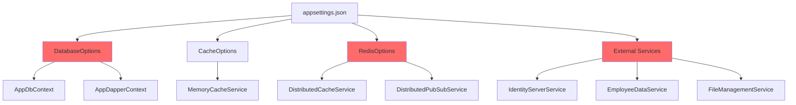

<div dir="rtl">

# نقشه کامل تنظیمات (Config Map) - سیستم پذیرش

## مقدمه

این سند شامل **تمامی کلیدهای تنظیمات** موجود در فایل‌های `appsettings*.json` و توضیحات کامل هر کلید است.

---

## فهرست تنظیمات

| بخش | تعداد کلیدها | حساسیت | محل استفاده اصلی |
|-----|--------------|---------|------------------|
| **DatabaseOptions** | 7 | 🔴 بحرانی | Persistence |
| **CacheOptions** | 2 | 🟡 متوسط | Services |
| **RedisOptions** | 6 | 🔴 بحرانی | Services |
| **CorsOptions** | 3 | 🟡 متوسط | WebApi |
| **GlobalOptions** | 3 | 🟡 متوسط | همه لایه‌ها |
| **Serilog** | 2+ | 🟢 عمومی | Logging |
| **SwaggerOptions** | 7 | 🟢 عمومی | WebApi |
| **DigestAuthenticationOptions** | 2 | 🔴 بحرانی | WebApi |
| **ElasticSearchOptions** | 2 | 🟡 متوسط | Logging |
| **IdentityServerOptions** | 4 | 🔴 بحرانی | Services |
| **EmployeeDataServiceOptions** | 3 | 🔴 بحرانی | Services |
| **StudentDataServiceOptions** | 3 | 🔴 بحرانی | Services |
| **FileManagementOptions** | 3 | 🔴 بحرانی | Services |

---

## 1. DatabaseOptions (پیکربندی دیتابیس)

### کلید اصلی: `DatabaseOptions`

**مسیر در appsettings.json**:
```json
{
  "DatabaseOptions": { ... }
}
```

**کلاس Binding**:
```csharp
public class DatabaseOptions
{
    public ConnectionStringsOptions ConnectionStrings { get; set; }
    public bool UseInMemoryDatabase { get; set; }
    public bool EnableLogging { get; set; }
    public bool EnableSensitiveDataLogging { get; set; }
    public bool EnablePooling { get; set; }
    public bool RunSeeders { get; set; }
    public int MaxPoolSize { get; set; }
}
```

**محل Bind شدن**: `DependencyInjection.cs` در Persistence layer

---

### 1.1. `ConnectionStrings.SqlServer`

**مقدار پیش‌فرض**:
```
Data Source=.\\MSSQLSERVER2017;Initial Catalog=[DBNAME];User ID=[USERNAME];Password=[PASSWORD];
```

**معنی**: رشته اتصال به SQL Server

**حساسیت**: 🔴 **بحرانی** - حاوی Password

**محل مصرف**: `AppDbContext`, `AppDapperContext`

**نکات**:
- ⚠️ رمز عبور در Plain Text است → باید از **User Secrets** یا **Azure Key Vault** استفاده شود
- ⚠️ باید در Production تغییر کند
- ✅ پشتیبانی از Integrated Security: `Integrated Security=true`

**مثال صحیح برای Production**:
```json
{
  "ConnectionStrings": {
    "SqlServer": "Server=prod-sql.example.com;Database=AdmissionDB;Integrated Security=true;MultipleActiveResultSets=true"
  }
}
```

---

### 1.2. `UseInMemoryDatabase`

**مقدار پیش‌فرض**: `false`

**معنی**: استفاده از دیتابیس حافظه به جای SQL Server

**محل مصرف**: `DependencyInjection.AddDbContext`

**استفاده**: فقط برای **تست واحد**

```csharp
if (dbOptions.UseInMemoryDatabase) {
    options.UseInMemoryDatabase("AdmissionTestDb");
} else {
    options.UseSqlServer(connectionString);
}
```

**⚠️ خطر**: اگر در Production `true` شود، داده‌ها از بین می‌روند!

---

### 1.3. `EnableLogging`

**مقدار پیش‌فرض**: `false`

**معنی**: فعال‌سازی لاگ EF Core Queries

**محل مصرف**: `DbContextOptionsBuilder`

```csharp
if (dbOptions.EnableLogging) {
    options.LogTo(Console.WriteLine, LogLevel.Information);
}
```

**تاثیر**:
- ✅ مفید برای Debugging
- ⚠️ کاهش Performance در Production
- 📊 لاگ همه SQL Query ها

**توصیه**: فقط در Development یا Staging فعال شود.

---

### 1.4. `EnableSensitiveDataLogging`

**مقدار پیش‌فرض**: `false`

**معنی**: نمایش مقادیر پارامترها در لاگ Query ها

```csharp
if (dbOptions.EnableSensitiveDataLogging) {
    options.EnableSensitiveDataLogging();
}
```

**مثال لاگ**:
```
// با EnableSensitiveDataLogging = true
SELECT * FROM Students WHERE NationalCode = '1234567890'

// با EnableSensitiveDataLogging = false
SELECT * FROM Students WHERE NationalCode = @p0
```

**⚠️ خطر امنیتی**: افشای اطلاعات حساس در لاگ‌ها

**توصیه**: **هرگز** در Production فعال نشود.

---

### 1.5. `EnablePooling`

**مقدار پیش‌فرض**: `true`

**معنی**: استفاده از Connection Pooling برای DbContext

**محل مصرف**:
```csharp
if (dbOptions.EnablePooling) {
    services.AddDbContextPool<AppDbContext>(
        options => ConfigureDbContext(options),
        poolSize: dbOptions.MaxPoolSize
    );
} else {
    services.AddDbContext<AppDbContext>(
        options => ConfigureDbContext(options)
    );
}
```

**تاثیر**:
- ⚡ **Performance**: تا 50% بهبود در High-Throughput scenarios
- 📈 **Scalability**: کاهش Overhead ایجاد DbContext
- ⚠️ **محدودیت**: Interceptors باید Transient باشند

**توصیه**: همیشه `true` در Production

---

### 1.6. `MaxPoolSize`

**مقدار پیش‌فرض**: `1024`

**معنی**: حداکثر تعداد DbContext در Pool

**تاثیر**:
- ✅ تعداد زیاد → پشتیبانی از Concurrent Requests بیشتر
- ⚠️ تعداد خیلی زیاد → فشار به SQL Server و RAM

**توصیه**:
- برای سرور کوچک: `128`
- برای سرور متوسط: `256-512`
- برای سرور بزرگ: `1024`

**فرمول تخمینی**:
```
MaxPoolSize = (تعداد CPU Cores × 2) × (تعداد Instance های API)
```

---

### 1.7. `RunSeeders`

**مقدار پیش‌فرض**: `false`

**معنی**: اجرای Seeder ها برای داده‌های اولیه

**محل مصرف**: `Program.cs` یا Startup

```csharp
if (dbOptions.RunSeeders) {
    await SeedDatabase(app.Services);
}
```

**استفاده**: فقط برای **اولین Setup** یا **Development**

**⚠️ خطر**: اگر در Production `true` باشد، داده‌های تست اضافه می‌شوند.

---

## 2. CacheOptions (پیکربندی کش)

### کلید اصلی: `CacheOptions`

```json
{
  "CacheOptions": {
    "AbsoluteExpirationSeconds": 1800,
    "SlidingExpirationSeconds": 600
  }
}
```

**کلاس Binding**:
```csharp
public class CacheOptions
{
    public int AbsoluteExpirationSeconds { get; set; }
    public int SlidingExpirationSeconds { get; set; }
}
```

**محل Bind**: `DependencyInjection.cs` در Services layer

**محل مصرف**: `MemoryCacheService`, `DistributedCacheService`

---

### 2.1. `AbsoluteExpirationSeconds`

**مقدار پیش‌فرض**: `1800` (30 دقیقه)

**معنی**: حداکثر زمان نگهداری در کش (مطلق)

**تاثیر**: بعد از 30 دقیقه، Cache منقضی می‌شود، **حتی اگر استفاده شده باشد**.

**مثال**:
```csharp
await cache.SetAsync("key", value, new CacheOptions
{
    AbsoluteExpirationSeconds = 1800 // 30 min
});
```

**توصیه**:
- داده‌های استاتیک (مثل لیست استان‌ها): `3600-7200` (1-2 ساعت)
- داده‌های پویا (مثل اطلاعات دانشجو): `600-1800` (10-30 دقیقه)

---

### 2.2. `SlidingExpirationSeconds`

**مقدار پیش‌فرض**: `600` (10 دقیقه)

**معنی**: زمان انقضای لغزشی - اگر به داده دسترسی نشود

**تاثیر**: اگر **10 دقیقه** به Cache دسترسی نشود، منقضی می‌شود. اما با هر دسترسی، تایمر ریست می‌شود.

**مثال**:
```
T=0:   Cache شد
T=5:   دسترسی → تایمر ریست (10 دقیقه دیگر معتبر)
T=10:  دسترسی → تایمر ریست
T=25:  دسترسی نشده → منقضی
```

**توصیه**: برای داده‌های پرتکرار، `SlidingExpiration` مناسب‌تر است.

---

## 3. RedisOptions (پیکربندی Redis)

### کلید اصلی: `RedisOptions`

```json
{
  "RedisOptions": {
    "Host": null,
    "Port": 6379,
    "Username": null,
    "Password": null,
    "TimeOutInSeconds": 3,
    "ConnectRetry": 3,
    "KeepAliveInSeconds": 60
  }
}
```

**کلاس Binding**:
```csharp
public class RedisOptions
{
    public string Host { get; set; }
    public int Port { get; set; }
    public string Username { get; set; }
    public string Password { get; set; }
    public int TimeOutInSeconds { get; set; }
    public int ConnectRetry { get; set; }
    public int KeepAliveInSeconds { get; set; }
}
```

**محل مصرف**: `DistributedCacheService`, `DistributedPubSubService`

---

### 3.1. `Host`

**مقدار پیش‌فرض**: `null`

**معنی**: آدرس سرور Redis

**⚠️ نکته**: اگر `null` باشد، Distributed Cache **غیرفعال** می‌شود و از Memory Cache استفاده می‌شود.

**مثال‌ها**:
- Local: `"localhost"` یا `"127.0.0.1"`
- Docker: `"redis"` (service name)
- Cloud: `"redis.example.com"`
- Azure: `"myredis.redis.cache.windows.net"`

---

### 3.2. `Port`

**مقدار پیش‌فرض**: `6379`

**معنی**: پورت Redis

**توصیه**: پیش‌فرض استاندارد Redis است.

---

### 3.3. `Username` و `Password`

**مقدار پیش‌فرض**: `null`

**معنی**: اعتبارسنجی Redis

**حساسیت**: 🔴 **بحرانی**

**نکات**:
- Redis 6+ پشتیبانی از Username دارد
- نسخه‌های قدیمی‌تر فقط Password
- ⚠️ باید در User Secrets یا Key Vault ذخیره شود

**مثال**:
```json
{
  "Username": "default",
  "Password": "your-redis-password"
}
```

---

### 3.4. `TimeOutInSeconds`

**مقدار پیش‌فرض**: `3`

**معنی**: Timeout اتصال به Redis

**تاثیر**: اگر Redis در 3 ثانیه پاسخ ندهد → Exception

**توصیه**: در Production شاید `5-10` بهتر باشد.

---

### 3.5. `ConnectRetry`

**مقدار پیش‌فرض**: `3`

**معنی**: تعداد تلاش مجدد برای اتصال

**تاثیر**: در صورت قطع اتصال، `3` بار تلاش می‌کند.

---

### 3.6. `KeepAliveInSeconds`

**مقدار پیش‌فرض**: `60`

**معنی**: ارسال Ping هر 60 ثانیه برای نگه‌داشتن Connection

**تاثیر**: جلوگیری از Timeout Connection در حالت Idle

---

## 4. CorsOptions (پیکربندی CORS)

### کلید اصلی: `CorsOptions`

```json
{
  "CorsOptions": {
    "Enabled": true,
    "Origins": ["*"],
    "Methods": ["GET", "POST", "PUT", "DELETE", "OPTIONS"]
  }
}
```

**محل مصرف**: `Program.cs` → Middleware Pipeline

---

### 4.1. `Enabled`

**مقدار پیش‌فرض**: `true`

**معنی**: فعال/غیرفعال کردن CORS

---

### 4.2. `Origins`

**مقدار پیش‌فرض**: `["*"]`

**معنی**: لیست دامنه‌های مجاز

**⚠️ خطر امنیتی**: `"*"` → **همه دامنه‌ها** مجاز هستند!

**توصیه برای Production**:
```json
{
  "Origins": [
    "https://admission.example.com",
    "https://admin.example.com"
  ]
}
```

---

### 4.3. `Methods`

**مقدار پیش‌فرض**: `["GET", "POST", "PUT", "DELETE", "OPTIONS"]`

**معنی**: HTTP Method های مجاز

**توصیه**: فقط Method های مورد نیاز را اجازه دهید.

---

## 5. GlobalOptions (تنظیمات عمومی)

### کلید اصلی: `GlobalOptions`

```json
{
  "GlobalOptions": {
    "IsDevelopment": false,
    "RunBackgroundServices": false,
    "AllowFileUpload": true
  }
}
```

**محل مصرف**: `Program.cs`, `GlobalOptions` static class

---

### 5.1. `IsDevelopment`

**مقدار پیش‌فرض**: `false`

**معنی**: فعال‌سازی حالت Development

**تاثیر**:
- Swagger فعال می‌شود
- XML Comments در DbContext اضافه می‌شود
- Exception Details نمایش داده می‌شوند

**استفاده**:
```csharp
if (GlobalOptions.IsDevelopment) {
    builder.AddXmlComments();
}
```

---

### 5.2. `RunBackgroundServices`

**مقدار پیش‌فرض**: `false`

**معنی**: اجرای Background Services

**Background Services**:
- `SyncPermissionsBackgroundService`
- `SendNotificationBackgroundService`

**توصیه**: در Production باید `true` باشد.

---

### 5.3. `AllowFileUpload`

**مقدار پیش‌فرض**: `true`

**معنی**: اجازه آپلود فایل

**محل مصرف**: Controller های مربوط به File Upload

---

## 6. Serilog (پیکربندی لاگینگ)

### کلید اصلی: `Serilog`

```json
{
  "Serilog": {
    "MinimumLevel": {
      "Default": "Information",
      "Override": {
        "Microsoft": "Warning",
        "System": "Warning",
        "Microsoft.Hosting.Diagnostics": "Warning",
        "Microsoft.Hosting.Lifetime": "Information"
      }
    },
    "EnableRequestLogging": false
  }
}
```

**محل مصرف**: `Program.cs` → Serilog Configuration

---

### 6.1. `MinimumLevel.Default`

**مقدار**: `"Information"`

**معنی**: حداقل سطح لاگ برای همه Namespace ها

**سطوح لاگ** (از کم به زیاد):
1. **Verbose**: همه چیز
2. **Debug**: اطلاعات دیباگ
3. **Information**: اطلاعات عمومی ⬅️ **پیش‌فرض**
4. **Warning**: هشدارها
5. **Error**: خطاها
6. **Fatal**: خطاهای بحرانی

---

### 6.2. `MinimumLevel.Override`

**معنی**: تنظیم سطح لاگ برای Namespace های خاص

**مثال**:
```json
{
  "Microsoft": "Warning"  // فقط Warning و بالاتر برای Microsoft.*
}
```

**توصیه**: کاهش لاگ‌های Framework (Microsoft, System) برای Reduce Noise

---

### 6.3. `EnableRequestLogging`

**مقدار پیش‌فرض**: `false`

**معنی**: لاگ کردن همه HTTP Request ها

**تاثیر**:
- ✅ مفید برای Debugging
- ⚠️ افزایش حجم لاگ
- ⚠️ احتمال افشای اطلاعات حساس (Query Strings, Headers)

**توصیه**: فقط در Development یا Troubleshooting فعال شود.

---

## 7. SwaggerOptions (پیکربندی Swagger/OpenAPI)

### کلید اصلی: `SwaggerOptions`

```json
{
  "SwaggerOptions": {
    "Enabled": false,
    "AddJwtSupport": true,
    "IncludeXmlDocuments": false,
    "PersistAuthorization": false,
    "Version": "1",
    "RoutePrefix": "swagger",
    "AssetsPrefix": "",
    "DocumentTitle": "My Api",
    "Description": "Description about this api"
  }
}
```

---

### 7.1. `Enabled`

**مقدار پیش‌فرض**: `false`

**معنی**: فعال/غیرفعال کردن Swagger UI

**⚠️ امنیت**: در Production باید `false` باشد (یا محافظت شده با Authentication)

---

### 7.2. `AddJwtSupport`

**مقدار**: `true`

**معنی**: اضافه کردن دکمه Authorize برای JWT Token

---

### 7.3. `IncludeXmlDocuments`

**مقدار**: `false`

**معنی**: شامل شدن XML Comments در Swagger

**تاثیر**: توضیحات `/// <summary>` در Swagger نمایش داده می‌شوند.

---

## 8. DigestAuthenticationOptions (احراز هویت Swagger/Health)

### کلید اصلی: `DigestAuthenticationOptions`

```json
{
  "DigestAuthenticationOptions": {
    "Users": [
      {
        "Username": "",
        "Password": "",
        "Role": "swagger"
      },
      {
        "Username": "",
        "Password": "",
        "Role": "health"
      }
    ],
    "Realm": "csis.ir"
  }
}
```

**حساسیت**: 🔴 **بحرانی**

**معنی**: کاربرانی که به Swagger و Health Checks دسترسی دارند

**⚠️ خطر**: Username/Password خالی است! باید در Production پر شود.

---

## 9. ElasticSearchOptions (پیکربندی ElasticSearch)

```json
{
  "ElasticSearchOptions": {
    "Enabled": true,
    "Url": "http://localhost:9200"
  }
}
```

**معنی**: ارسال لاگ‌ها به ElasticSearch

**استفاده**: Centralized Logging

---

## 10. External Service Options

### 10.1. IdentityServerOptions

```json
{
  "IdentityServerOptions": {
    "BaseUrl": "",
    "ApiKey": "[YOUR-API-KEY]",
    "TimeoutInSeconds": 30,
    "EnableDeveloperMode": false
  }
}
```

**حساسیت**: 🔴 **بحرانی**

**معنی**: تنظیمات اتصال به Identity Server

**استفاده**:
- Login/Logout
- Token Validation
- User Management

---

### 10.2. EmployeeDataServiceOptions

```json
{
  "EmployeeDataServiceOptions": {
    "BaseUrl": "",
    "ApiKey": "[YOUR-API-KEY]",
    "TimeoutInSeconds": 30
  }
}
```

**معنی**: سرویس داده کارکنان

**استفاده**: دریافت اطلاعات کارمندان از سرویس مرکزی

---

### 10.3. StudentDataServiceOptions

```json
{
  "StudentDataServiceOptions": {
    "BaseUrl": "",
    "ApiKey": "[YOUR-API-KEY]",
    "TimeoutInSeconds": 30
  }
}
```

**معنی**: سرویس داده دانشجویان

**استفاده**: دریافت اطلاعات دانشجویان از سرویس مرکزی

---

### 10.4. FileManagementOptions

```json
{
  "FileManagementOptions": {
    "BaseUrl": "",
    "ApiKey": "[YOUR-API-KEY]",
    "TimeoutInSeconds": 30
  }
}
```

**معنی**: سرویس مدیریت فایل

**استفاده**: Upload/Download تصاویر، مدارک

---

## 11. AllowedHosts

```json
{
  "AllowedHosts": "*"
}
```

**معنی**: لیست Host های مجاز

**⚠️ امنیت**: `"*"` → همه Host ها مجاز

**توصیه Production**:
```json
{
  "AllowedHosts": "admission.example.com;api.example.com"
}
```

---

## خلاصه: تنظیمات بحرانی که باید در Production تغییر کنند

| کلید | مقدار فعلی | خطر | توصیه |
|------|-----------|-----|-------|
| `DatabaseOptions.ConnectionStrings.SqlServer` | Placeholder | 🔴 | رمز در Key Vault |
| `DatabaseOptions.EnableSensitiveDataLogging` | `false` | 🟢 | ✅ درست است |
| `CorsOptions.Origins` | `["*"]` | 🔴 | دامنه‌های خاص |
| `SwaggerOptions.Enabled` | `false` | 🟢 | ✅ یا با Auth |
| `DigestAuthenticationOptions.Users` | خالی | 🔴 | باید پر شود |
| `RedisOptions.Password` | `null` | 🔴 | اگر Redis دارد |
| `IdentityServerOptions.ApiKey` | Placeholder | 🔴 | API Key واقعی |
| `FileManagementOptions.ApiKey` | Placeholder | 🔴 | API Key واقعی |
| `AllowedHosts` | `"*"` | 🔴 | Host های خاص |
| `GlobalOptions.RunBackgroundServices` | `false` | 🟡 | `true` در Prod |

---

## نمودار وابستگی تنظیمات



---

## Checklist برای Production

- [ ] تغییر Connection String و استفاده از Managed Identity یا Key Vault
- [ ] پر کردن `DigestAuthenticationOptions.Users`
- [ ] تنظیم `CorsOptions.Origins` به دامنه‌های خاص
- [ ] تنظیم `AllowedHosts` به Host های خاص
- [ ] پر کردن API Key های سرویس‌های خارجی
- [ ] تنظیم `RedisOptions` برای Production Redis
- [ ] غیرفعال کردن `Swagger` یا محافظت با Authentication
- [ ] فعال کردن `GlobalOptions.RunBackgroundServices`
- [ ] بررسی `DatabaseOptions.MaxPoolSize` بر اساس منابع سرور
- [ ] فعال کردن `ElasticSearch` برای Centralized Logging

---

</div>
