

# نمودار وابستگی‌ها (Dependency Graph) - سیستم پذیرش

## مقدمه

این سند شامل **نمودارهای وابستگی** در سطوح مختلف معماری سیستم است.

---

## 1. نمودار Solution Level

### 1.1. وابستگی‌های پروژه‌ها

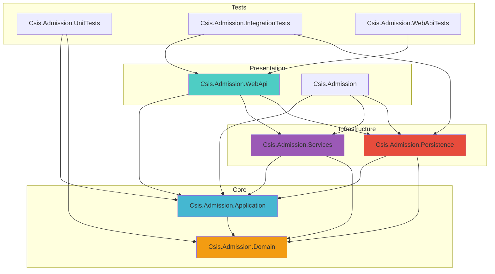

---

### 1.2. جدول وابستگی‌های پروژه

| پروژه | وابسته به | نوع | توضیح |
|------|----------|-----|-------|
| **WebApi** | Application | Project Ref | استفاده از Features |
| **WebApi** | Services | Project Ref | استفاده از External Services |
| **WebApi** | Persistence | Project Ref | DI Registration |
| **Application** | Domain | Project Ref | استفاده از Entities & Enums |
| **Persistence** | Application | Project Ref | پیاده‌سازی Interfaces |
| **Persistence** | Domain | Project Ref | EF Configurations |
| **Services** | Application | Project Ref | پیاده‌سازی Services |

---

## 2. نمودار Layer Dependencies

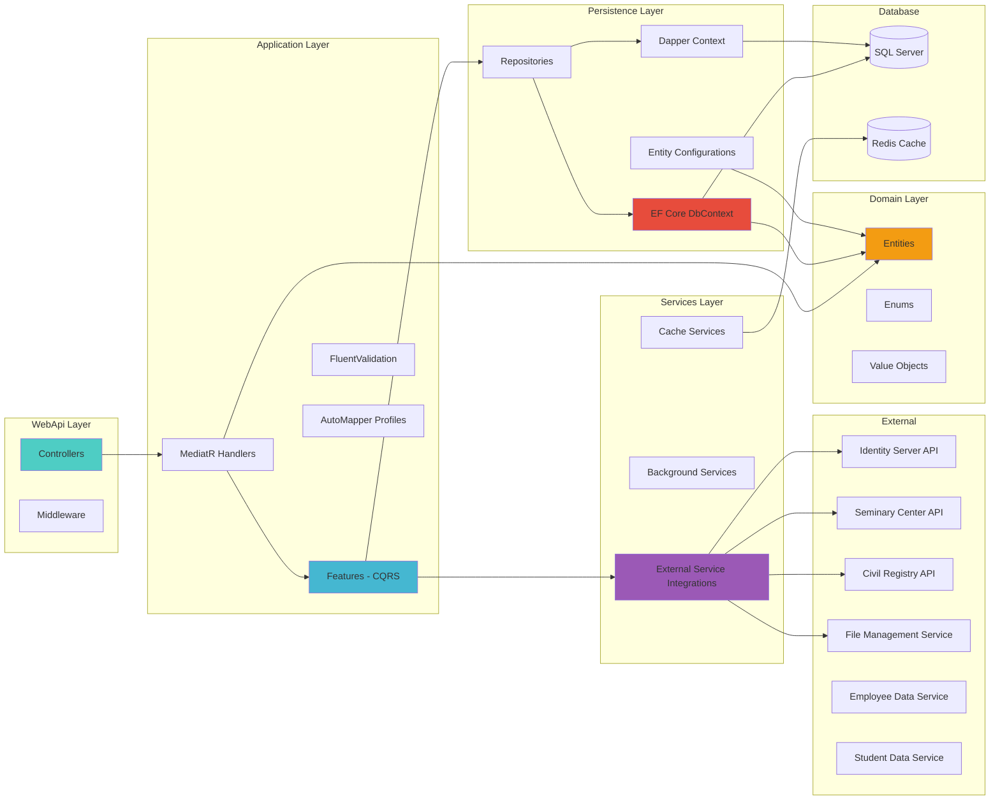

---

## 3. نمودار Use Case Level (نمونه: تشکیل پرونده)

### UC-030: تشکیل پرونده دانشجوی جدید

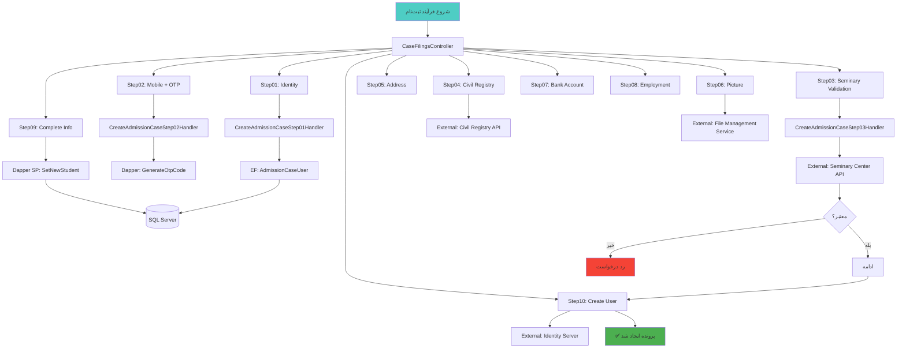

---

## 4. نمودار Feature Dependencies (نمونه: Students Feature)

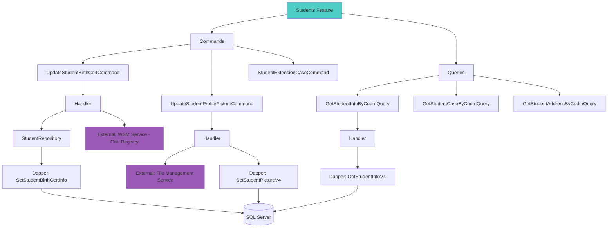

---

## 5. نمودار Service Dependencies

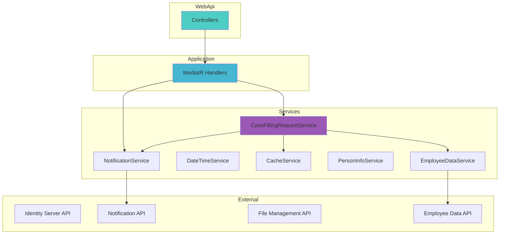

---

## 6. نمودار Data Access Layer

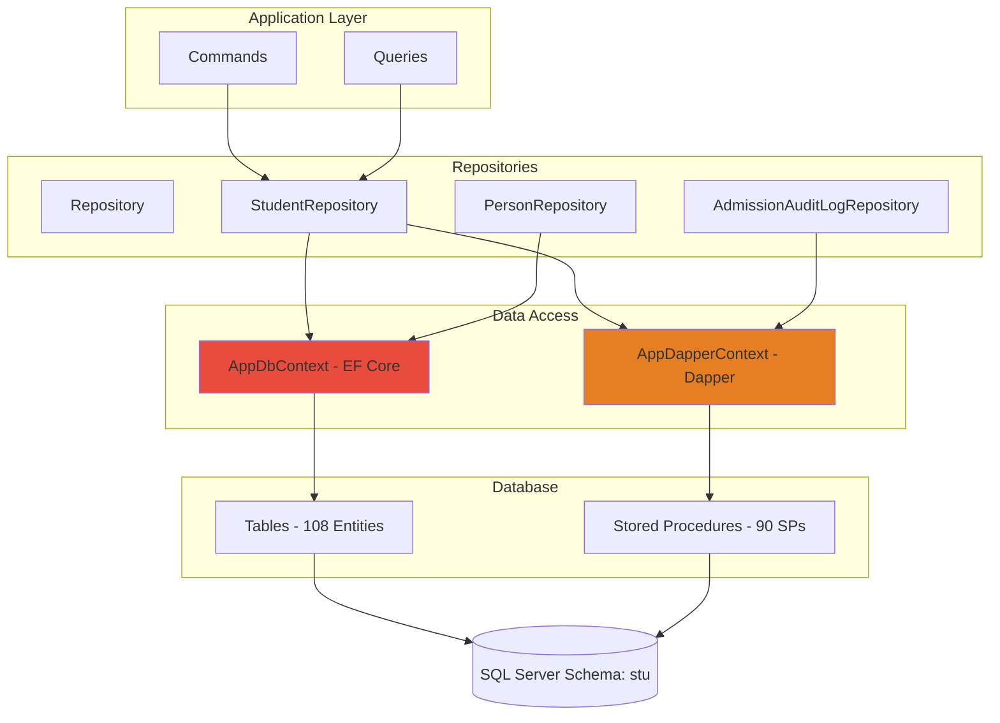

---

## 7. نمودار External Service Integrations

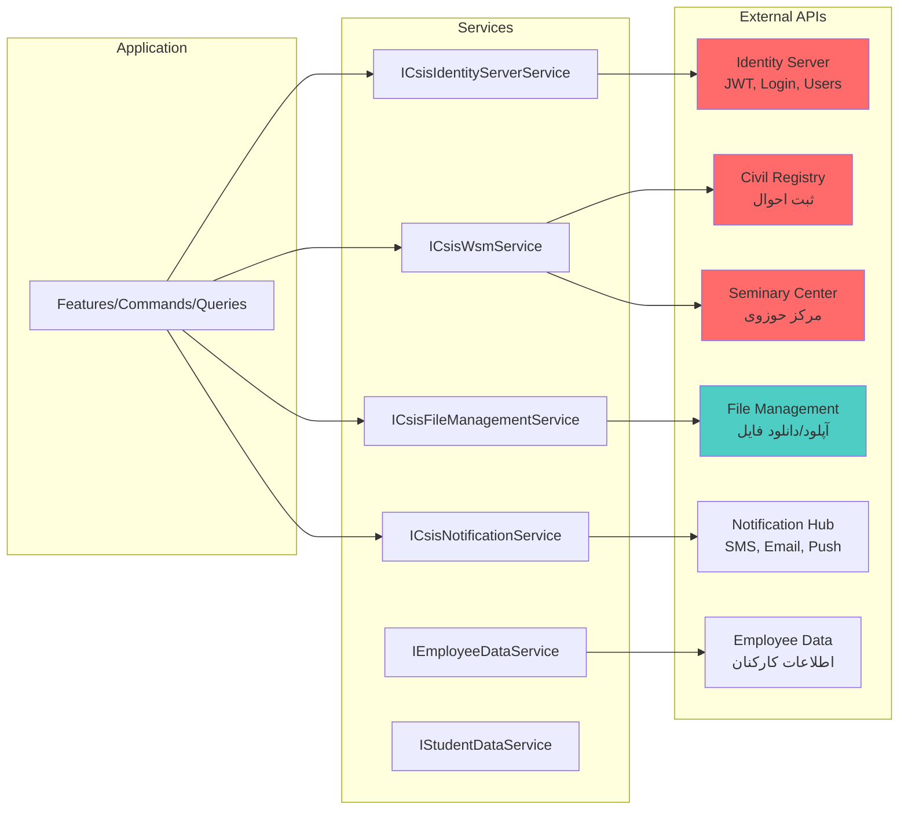

---

## 8. نمودار Background Services

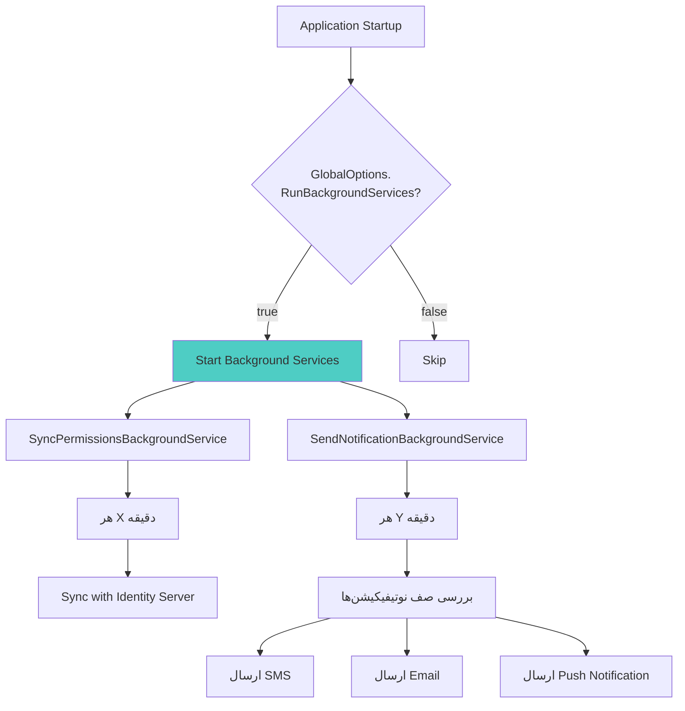

---

## 9. نمودار Cache Strategy

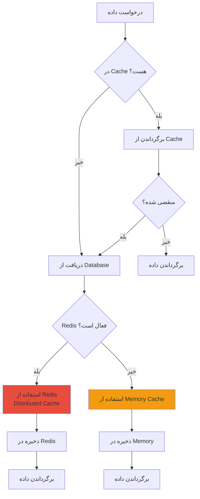

---

## 10. نمودار Transaction Boundaries

### مشکل: EF Core و Dapper در Transaction های جدا

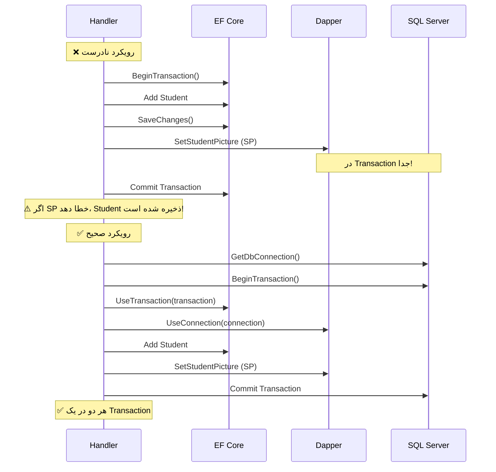

---

## 11. جدول خلاصه وابستگی‌ها

### وابستگی‌های اصلی Features

| Feature | EF Entities | Dapper SPs | External Services | Internal Services |
|---------|------------|-----------|------------------|------------------|
| **Students** | Student, Person | GetStudentInfoV4, SetStudentBirthCertInfo | WSM, FileManagement | - |
| **CaseFilings** | AdmissionCaseUser | SetNewStudent, ValidateStudentStatus | Seminary, Civil, Identity | CaseFillingRequestService |
| **Auth** | - | GenerateOtpCode | IdentityServer | - |
| **BankAccounts** | - | SetStudentBankAccountNumberV4, CheckDuplicate | - | - |
| **Addresses** | Address | CheckAddressApproveV4 | - | - |
| **Marriages** | Marriage | SetStudentDivorceV4, SetDependentChildMarriage | - | - |
| **ImamJamaat** | Mosque, MosqueInfo | ValidateReligiousRoleV4 | - | - |

---

### وابستگی‌های External Services

| Service | Target API | Usage | Authentication |
|---------|-----------|-------|----------------|
| **ICsisIdentityServerService** | Identity Server | Login, JWT, Users | API Key |
| **ICsisWsmService** | Civil Registry + Seminary | اعتبارسنجی هویت، حوزه | API Key |
| **ICsisFileManagementService** | File Management | Upload/Download | API Key |
| **ICsisNotificationService** | Notification Hub | SMS, Email, Push | API Key |
| **IEmployeeDataService** | Employee Data | اطلاعات کارکنان | API Key |
| **IStudentDataService** | Student Data | اطلاعات دانشجویان | API Key |

---

## 12. نمودار Deployment (احتمالی)

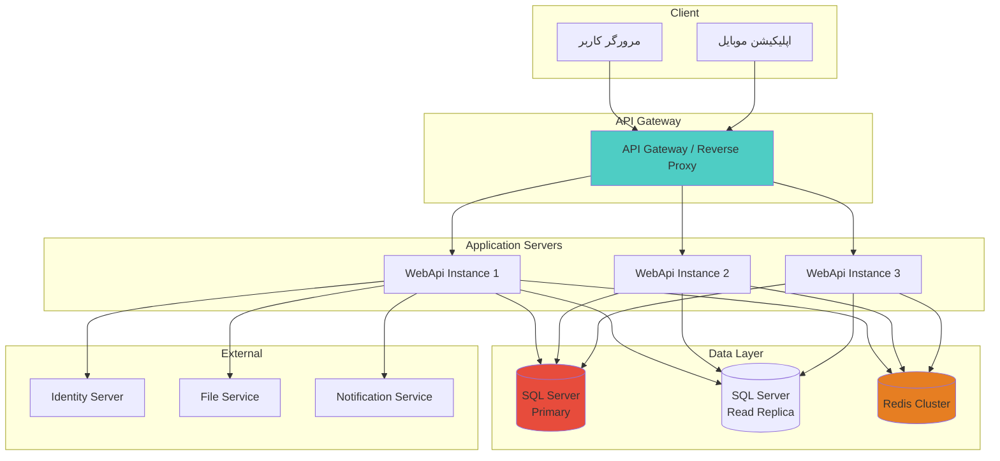

---

## نتیجه‌گیری

این نمودارها وابستگی‌های سیستم را در سطوح مختلف نشان می‌دهند:
- ✅ Solution Level: وابستگی پروژه‌ها
- ✅ Layer Level: جریان داده بین لایه‌ها
- ✅ Use Case Level: فلوی یک Use Case خاص
- ✅ Feature Level: وابستگی‌های یک Feature
- ✅ Service Level: یکپارچه‌سازی‌های خارجی
- ✅ Data Access Level: EF Core + Dapper
- ✅ Cache Strategy: چگونه Cache کار می‌کند
- ✅ Transaction Boundaries: چالش‌های Transaction

