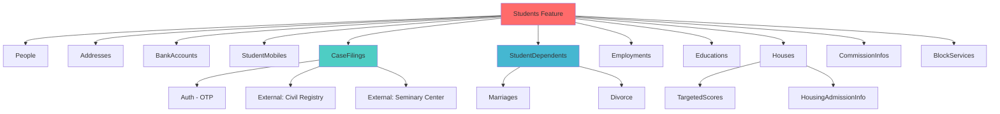

<div dir="rtl">

# کاتالوگ جامع Features - سیستم پذیرش

## مقدمه

این سند شامل لیست کامل و جامع **72 Feature Module** موجود در پروژه سیستم پذیرش است. هر Feature بر اساس الگوی **CQRS** با استفاده از **MediatR** پیاده‌سازی شده است.

## ساختار استاندارد یک Feature

```
Feature/
├── Commands/           # عملیات تغییردهنده (Create, Update, Delete)
├── Queries/            # عملیات خواندنی (Get, GetAll, Search)
├── Dtos/               # Data Transfer Objects
├── Validators/         # FluentValidation validators
└── Profiles/           # AutoMapper mapping profiles
```

## خلاصه آماری

| متریک | تعداد |
|------|------|
| تعداد کل Features | 72 |
| تعداد کل Commands | 289 |
| تعداد کل Queries | 168 |
| تعداد کل DTOs | 174 |
| تعداد کل Validators | 141 |

---

## جدول جامع Features

| # | نام Feature | تعداد Commands | تعداد Queries | تعداد DTOs | تعداد Validators | دامنه کاری | اولویت |
|---|------------|---------------|--------------|-----------|-----------------|-----------|---------|
| 1 | **Addresses** | 5 | 2 | 1 | 1 | مدیریت آدرس‌های دانشجویان | بحرانی ⚠️ |
| 2 | **AdmissionAuditLogs** | 0 | 2 | 2 | 0 | لاگ‌های ممیزی پذیرش | متوسط |
| 3 | **Auth** | 3 | 0 | 1 | 1 | احراز هویت و ورود | بحرانی ⚠️ |
| 4 | **BankAccounts** | 4 | 1 | 2 | 2 | مدیریت حساب‌های بانکی | بحرانی ⚠️ |
| 5 | **BlockServices** | 6 | 4 | 3 | 4 | مسدودی خدمات | بحرانی ⚠️ |
| 6 | **Branches** | 0 | 4 | 2 | 0 | مدیریت شعب و نمایندگی‌ها | پایه |
| 7 | **CaseBlock** | 4 | 0 | 0 | 2 | مسدودی پرونده | بحرانی ⚠️ |
| 8 | **CaseFilings** | 16 | 4 | 10 | 13 | تشکیل و ثبت پرونده | بحرانی ⚠️ |
| 9 | **Cities** | 0 | 1 | 1 | 0 | شهرها | پایه |
| 10 | **CommissionInfos** | 0 | 2 | 2 | 0 | اطلاعات کمیسیون | مهم |
| 11 | **CompleteStudentInfos** | 0 | 1 | 1 | 0 | اطلاعات کامل دانشجو | مهم |
| 12 | **ContinuousInformationTabs** | 0 | 0 | 0 | 0 | تب‌های اطلاعات مستمر | پایه |
| 13 | **Countries** | 0 | 1 | 1 | 0 | کشورها | پایه |
| 14 | **CountryDivisions** | 3 | 0 | 0 | 3 | تقسیمات کشوری | پایه |
| 15 | **CulturalActivities** | 4 | 2 | 1 | 2 | فعالیت‌های فرهنگی | متوسط |
| 16 | **CulturalActivityGrades** | 2 | 1 | 1 | 0 | نمرات فعالیت فرهنگی | متوسط |
| 17 | **DependentActiveReasons** | 0 | 1 | 1 | 0 | دلایل فعال‌سازی تکفل | پایه |
| 18 | **DependentCaseActive** | 6 | 1 | 1 | 2 | فعال/غیرفعال پرونده تکفل | بحرانی ⚠️ |
| 19 | **DependentDeActiveReasons** | 0 | 1 | 1 | 0 | دلایل غیرفعال‌سازی تکفل | پایه |
| 20 | **DependentEmployments** | 1 | 1 | 1 | 1 | اشتغال تکفل | متوسط |
| 21 | **Divorce** | 8 | 1 | 0 | 2 | ثبت طلاق | مهم |
| 22 | **Documents** | 1 | 1 | 1 | 1 | مدارک | متوسط |
| 23 | **EducationYears** | 0 | 1 | 1 | 0 | سال‌های تحصیلی | پایه |
| 24 | **Educations** | 1 | 1 | 1 | 1 | تحصیلات | مهم |
| 25 | **EliteLevels** | 0 | 1 | 1 | 0 | سطوح نخبگان | پایه |
| 26 | **EliteTypes** | 0 | 1 | 1 | 0 | انواع نخبگان | پایه |
| 27 | **Elites** | 6 | 2 | 1 | 2 | نخبگان | متوسط |
| 28 | **EmployeeViewStudentLogs** | 1 | 2 | 2 | 0 | لاگ مشاهده کارمند | متوسط |
| 29 | **Employments** | 13 | 3 | 2 | 3 | اشتغال دانشجو | مهم |
| 30 | **ExcellentEducationLevels** | 0 | 1 | 1 | 0 | سطوح تحصیلی برتر | پایه |
| 31 | **ExcellentEducationYears** | 0 | 1 | 1 | 0 | سال‌های تحصیلی برتر | پایه |
| 32 | **Excellents** | 2 | 1 | 1 | 0 | برترین‌ها | متوسط |
| 33 | **Family** | 0 | 2 | 1 | 2 | خانواده | مهم |
| 34 | **Famouses** | 6 | 3 | 1 | 2 | مشاهیر | متوسط |
| 35 | **Files** | 2 | 1 | 2 | 0 | فایل‌ها | متوسط |
| 36 | **Houses** | 5 | 1 | 2 | 1 | مسکن و خانه | مهم |
| 37 | **HousingAdmissionInfo** | 1 | 4 | 5 | 0 | اطلاعات پذیرش مسکن | مهم |
| 38 | **ImamJamaat** | 12 | 7 | 15 | 3 | امام جماعت و نقش مذهبی | مهم |
| 39 | **Insurances** | 0 | 1 | 1 | 0 | بیمه‌ها | متوسط |
| 40 | **Marriages** | 8 | 2 | 4 | 10 | ازدواج | مهم |
| 41 | **Memorizers** | 3 | 2 | 2 | 1 | حافظان قرآن | متوسط |
| 42 | **NonIranianStudent** | 7 | 0 | 0 | 4 | دانشجوی غیر ایرانی | مهم |
| 43 | **NonStudentDependants** | 3 | 2 | 2 | 2 | افراد تحت تکفل غیر دانشجو | متوسط |
| 44 | **NonStudents** | 3 | 2 | 2 | 2 | غیر دانشجویان | متوسط |
| 45 | **Notifications** | 1 | 1 | 0 | 1 | نوتیفیکیشن‌ها | مهم |
| 46 | **People** | 16 | 4 | 4 | 12 | مدیریت افراد | بحرانی ⚠️ |
| 47 | **PictureHistories** | 0 | 1 | 1 | 0 | تاریخچه تصاویر | متوسط |
| 48 | **Portions** | 0 | 1 | 1 | 0 | بخش‌ها (تقسیمات) | پایه |
| 49 | **PreachGrades** | 4 | 2 | 1 | 2 | نمرات تبلیغ | متوسط |
| 50 | **Preaches** | 7 | 2 | 1 | 3 | تبلیغات مذهبی | متوسط |
| 51 | **Pregnancies** | 3 | 1 | 1 | 0 | بارداری | متوسط |
| 52 | **Protests** | 2 | 1 | 1 | 1 | اعتراضات | متوسط |
| 53 | **Provinces** | 0 | 1 | 1 | 0 | استان‌ها | پایه |
| 54 | **ReligiousRoleQuestions** | 2 | 0 | 0 | 1 | سوالات نقش‌آفرینی | متوسط |
| 55 | **ReportBuilders** | 3 | 5 | 4 | 2 | سازنده گزارش | مهم |
| 56 | **ReportProfiles** | 3 | 2 | 1 | 2 | پروفایل گزارش | مهم |
| 57 | **ResearchGrades** | 4 | 2 | 1 | 2 | نمرات پژوهش | متوسط |
| 58 | **Researches** | 6 | 2 | 1 | 2 | پژوهش‌ها | متوسط |
| 59 | **Rurals** | 0 | 1 | 1 | 0 | روستاها | پایه |
| 60 | **Schools** | 0 | 1 | 1 | 0 | مدارس | پایه |
| 61 | **Settings** | 2 | 2 | 1 | 2 | تنظیمات سیستم | بحرانی ⚠️ |
| 62 | **SoldierStudents** | 3 | 2 | 1 | 2 | دانشجویان سرباز | متوسط |
| 63 | **StudentDependents** | 6 | 3 | 5 | 4 | افراد تحت تکفل دانشجو | بحرانی ⚠️ |
| 64 | **StudentFriends** | 4 | 2 | 2 | 0 | دوستان دانشجو | متوسط |
| 65 | **StudentMobiles** | 5 | 1 | 1 | 2 | شماره موبایل دانشجو | مهم |
| 66 | **Students** | 24 | 23 | 22 | 12 | دانشجویان (هسته اصلی) | بحرانی ⚠️ |
| 67 | **TargetedScores** | 0 | 3 | 2 | 0 | امتیازهای هدفمند | مهم |
| 68 | **TeachGrades** | 4 | 2 | 1 | 2 | نمرات تدریس | متوسط |
| 69 | **Teaches** | 7 | 2 | 1 | 3 | تدریس‌ها | متوسط |
| 70 | **Towns** | 0 | 1 | 1 | 0 | شهرها (Towns) | پایه |
| 71 | **UniversityEducations** | 14 | 2 | 2 | 1 | تحصیلات دانشگاهی | مهم |
| 72 | **Veterans** | 7 | 1 | 1 | 0 | جانبازان/ایثارگران | متوسط |

---

## دسته‌بندی Features بر اساس دامنه کاری

### 1️⃣ Core Student Management (مدیریت اصلی دانشجو)
Features اصلی مرتبط با دانشجو:

- **Students** (24C, 23Q) - هسته اصلی سیستم
  - مدیریت کامل اطلاعات دانشجو
  - بروزرسانی شناسنامه‌ای
  - تمدید پرونده
  - سینک با ثبت احوال
  - مدیریت تصویر پروفایل
  
- **People** (16C, 4Q) - مدیریت اطلاعات افراد
- **CompleteStudentInfos** (0C, 1Q) - اطلاعات کامل
- **StudentMobiles** (5C, 1Q) - شماره تماس
- **BankAccounts** (4C, 1Q) - حساب بانکی
- **Addresses** (5C, 2Q) - آدرس‌ها

**وابستگی‌ها**:
- EF: `Student`, `Person`, `Address`, `BankAccount`, `StudentMobile`
- Dapper: `GetStudentInfoV4`, `GetStudentCaseInfoV4`, `SetStudentBirthCertInfo`
- External: `EmployeeDataService`, `StudentDataService`, `IdentityServer`

---

### 2️⃣ Case Management (مدیریت پرونده)

- **CaseFilings** (16C, 4Q) - تشکیل پرونده (Wizard 10 مرحله‌ای)
  - Step01-10: فرآیند کامل ثبت‌نام
  - اعتبارسنجی هویت
  - تایید موبایل
  - اعتبارسنجی مرکز حوزوی
  - ثبت اطلاعات شناسنامه‌ای، آدرس، بانکی، شغلی
  - ایجاد کاربر
  
- **CaseBlock** (4C, 0Q) - مسدودی/رفع مسدودی پرونده
- **DependentCaseActive** (6C, 1Q) - فعال/غیرفعال پرونده تکفل

**قوانین کسب‌وکار**:
- ✅ تایید مرکز حوزوی الزامی
- ✅ اعتبارسنجی کد ملی از ثبت احوال
- ✅ تایید موبایل با OTP
- ✅ آدرس نیاز به تایید 2 طلبه دارد

**وابستگی‌ها**:
- SP: `SetNewStudent`, `ValidateStudentStatusForRegisterationV4`, `CheckAddressApproveV4`
- External: `IdentityServer` (OTP), Civil Registry API

---

### 3️⃣ Dependents Management (مدیریت افراد تحت تکفل)

- **StudentDependents** (6C, 3Q) - تکفل دانشجو
- **NonStudentDependants** (3C, 2Q) - تکفل غیر دانشجو
- **DependentEmployments** (1C, 1Q) - اشتغال تکفل
- **DependentActiveReasons** (0C, 1Q) - دلایل فعال‌سازی
- **DependentDeActiveReasons** (0C, 1Q) - دلایل غیرفعال‌سازی

**وابستگی‌ها**:
- SP: `SetNewDependent`, `DeActiveDependentV4`, `SetDependentActive`
- EF: `Dependent`, `DependentCase`

---

### 4️⃣ Family Events (رویدادهای خانوادگی)

- **Marriages** (8C, 2Q, 10V) - ازدواج
  - ثبت ازدواج دانشجو
  - ثبت ازدواج تکفل (فرزندان/همسران بیوه)
  
- **Divorce** (8C, 1Q) - طلاق
  - ثبت طلاق سرپرست
  - ثبت طلاق تکفل
  
- **Pregnancies** (3C, 1Q) - بارداری
- **Family** (0C, 2Q) - اطلاعات خانواده

**قوانین کسب‌وکار**:
- ⚠️ ازدواج تکفل → بستن پرونده
- ⚠️ طلاق همسر → غیرفعال کردن پرونده تکفل
- ⚠️ طلاق فرزند → تغییری در پرونده ندارد

**وابستگی‌ها**:
- SP: `SetStudentSisterMarriage`, `SetStudentDivorceV4`, `SetDependentChildMarriage`, `SetDependentSpouseMarriage`, `SetDependentSpouseDivorce`, `SetDependentChildDivorce`

---

### 5️⃣ Academic & Cultural Activities (فعالیت‌های علمی و فرهنگی)

#### تحصیلات
- **Educations** (1C, 1Q) - تحصیلات حوزوی
- **UniversityEducations** (14C, 2Q) - تحصیلات دانشگاهی
- **EducationYears** (0C, 1Q) - سال‌های تحصیلی

#### فعالیت‌های علمی
- **Researches** (6C, 2Q) - پژوهش‌ها
- **ResearchGrades** (4C, 2Q) - نمرات پژوهش
- **Teaches** (7C, 2Q) - تدریس
- **TeachGrades** (4C, 2Q) - نمرات تدریس

#### فعالیت‌های فرهنگی/مذهبی
- **Preaches** (7C, 2Q) - تبلیغ
- **PreachGrades** (4C, 2Q) - نمرات تبلیغ
- **CulturalActivities** (4C, 2Q) - فعالیت‌های فرهنگی
- **CulturalActivityGrades** (2C, 1Q) - نمرات فعالیت فرهنگی
- **Memorizers** (3C, 2Q) - حافظان قرآن
- **ImamJamaat** (12C, 7Q) - امام جماعت
- **ReligiousRoleQuestions** (2C, 0Q) - سوالات نقش‌آفرینی

---

### 6️⃣ Excellence & Honors (نخبگان و ممتازین)

- **Elites** (6C, 2Q) - نخبگان
- **EliteLevels** (0C, 1Q) - سطوح نخبگان
- **EliteTypes** (0C, 1Q) - انواع نخبگان
- **Excellents** (2C, 1Q) - برترین‌ها
- **ExcellentEducationLevels** (0C, 1Q)
- **ExcellentEducationYears** (0C, 1Q)
- **Famouses** (6C, 3Q) - مشاهیر
- **Veterans** (7C, 1Q) - جانبازان/ایثارگران

---

### 7️⃣ Employment & Insurance (اشتغال و بیمه)

- **Employments** (13C, 3Q) - اشتغال دانشجو
- **DependentEmployments** (1C, 1Q) - اشتغال تکفل
- **SoldierStudents** (3C, 2Q) - دانشجویان سرباز
- **Insurances** (0C, 1Q) - بیمه‌ها

**وابستگی‌ها**:
- SP: `GetTaminInsuranceInfoV4` - استعلام بیمه تامین اجتماعی

---

### 8️⃣ Housing & Targeting (مسکن و هدفمندی)

- **Houses** (5C, 1Q) - اطلاعات مسکن
- **HousingAdmissionInfo** (1C, 4Q) - پذیرش مسکن
- **TargetedScores** (0C, 3Q) - امتیازهای هدفمند

**وابستگی‌ها**:
- SP: `GetTargetedScoreInfoV4`, `GetSubsistenceTargetedScoreInfoV4`, `GetTarazAndLivelihoodTotalScoreAndTotalScore`, `GetHouseHistoryV4`

---

### 9️⃣ Commission & Approval (کمیسیون و تایید)

- **CommissionInfos** (0C, 2Q) - اطلاعات کمیسیون
  - کمیسیون دانشجو
  - کمیسیون تکفل

**وابستگی‌ها**:
- SP: `GetStudentCommission`, `GetDependentCommission`, `GetCommissionForNewStudent`, `SetCommissionStatus`, `GetDependentPensionCommission`

---

### 🔟 Services & Blocking (خدمات و مسدودی)

- **BlockServices** (6C, 4Q) - خدمات مسدود
  - مسدودی خدمات دانشجو
  - مسدودی خدمات تکفل
  - رفع مسدودی

**قوانین کسب‌وکار**:
- 🚫 خدمات قابل مسدودی: کارت، پرداخت، مسکن، وام و...
- ✅ مسدودی نیاز به دلیل دارد
- ✅ رفع مسدودی نیاز به تایید مسئول دارد

**وابستگی‌ها**:
- SP: `GetStudentBlockedService`, `GetDependentBlockedService`, `SetStudentBlocked`, `SetStudentUnBlocked`

---

### 1️⃣1️⃣ Authentication & Authorization (احراز هویت)

- **Auth** (3C, 0Q) - احراز هویت
  - `LoginCommand` - ورود کارمند
  - `LoginStudentCommand` - ورود دانشجو
  - `RefreshTokenCommand` - تمدید توکن

**وابستگی‌ها**:
- External: `IdentityServer` (JWT)
- SP: `GenerateOtpCode`

---

### 1️⃣2️⃣ Reporting & Audit (گزارش‌گیری و ممیزی)

- **ReportBuilders** (3C, 5Q) - سازنده گزارش سفارشی
- **ReportProfiles** (3C, 2Q) - پروفایل‌های گزارش
- **AdmissionAuditLogs** (0C, 2Q) - لاگ‌های ممیزی
  - لاگ دانشجو
  - لاگ تکفل
  
- **EmployeeViewStudentLogs** (1C, 2Q) - لاگ مشاهده کارمند

**وابستگی‌ها**:
- SP: `GetStudentAuditLog`, `GetDependentAuditLog`, `GetLastViewedCodm`, `GetTableRecordCountV4`

---

### 1️⃣3️⃣ Master Data & Lookups (داده‌های پایه)

#### تقسیمات جغرافیایی
- **Countries** (0C, 1Q) - کشورها
- **Provinces** (0C, 1Q) - استان‌ها
- **Cities** (0C, 1Q) - شهرها
- **Towns** (0C, 1Q) - شهرستان‌ها
- **Rurals** (0C, 1Q) - روستاها
- **Portions** (0C, 1Q) - بخش‌ها
- **CountryDivisions** (3C, 0Q) - تقسیمات کشوری (ایجاد شهر/روستا/بخش)

#### سازمانی
- **Branches** (0C, 4Q) - شعب و نمایندگی‌ها
- **Schools** (0C, 1Q) - مدارس

**وابستگی‌ها**:
- SP: `SetTown`, `SetRural`, `SetPortion`, `UpdateBranchAndAgency`

---

### 1️⃣4️⃣ File & Document Management (مدیریت فایل و مدارک)

- **Files** (2C, 1Q) - مدیریت فایل‌ها
- **Documents** (1C, 1Q) - مدارک
- **PictureHistories** (0C, 1Q) - تاریخچه تصاویر

**وابستگی‌ها**:
- External: `FileManagementService`
- SP: `SetStudentPictureV4`, `GetStudentPictureV4`, `SetStudentTmpPictureV4`, `GetStudentTmpPictureV4`, `GetStudentPictureHistoryV4`

---

### 1️⃣5️⃣ Notifications & Communication (نوتیفیکیشن و ارتباطات)

- **Notifications** (1C, 1Q) - نوتیفیکیشن‌ها
- **StudentFriends** (4C, 2Q) - دوستان دانشجو (شبکه اجتماعی)

**وابستگی‌ها**:
- Background Service: `SendNotificationBackgroundService`
- Service: `NotificationService`

---

### 1️⃣6️⃣ Settings & Configuration (تنظیمات)

- **Settings** (2C, 2Q) - تنظیمات سیستم
- **ContinuousInformationTabs** (0C, 0Q) - تنظیمات تب‌ها

---

### 1️⃣7️⃣ Protests & Feedback (اعتراضات)

- **Protests** (2C, 1Q) - اعتراضات

**وابستگی‌ها**:
- SP: `GetProtestPossibility`

---

### 1️⃣8️⃣ Non-Iranian Students (دانشجویان غیر ایرانی)

- **NonIranianStudent** (7C, 0Q) - دانشجوی غیر ایرانی
  - بروزرسانی اطلاعات شناسنامه‌ای
  - بروزرسانی تابعیت
  
- **NonStudents** (3C, 2Q) - غیر دانشجویان

**وابستگی‌ها**:
- SP: `UpdateNonIranianStudentIdentity`, `UpdateNonIranianDependentIdentity`, `UpdateNonIranianStudentCitizenship`, `UpdateNonIranianDependentCitizenship`

---

## الگوهای مشترک Commands

### 1. Create Commands
```csharp
public record CreateXCommand : IRequest<int>
{
    // Properties
}

internal class CreateXCommandHandler(Dependencies...) 
    : IRequestHandler<CreateXCommand, int>
{
    public async Task<int> Handle(CreateXCommand command, CancellationToken ct) 
    {
        // Validation
        // Business Rules
        // Save to DB
        // Return ID
    }
}
```

### 2. Update Commands
```csharp
public record UpdateXCommand : IRequest
{
    public int Id { get; init; }
    // Other properties
}
```

### 3. Delete Commands
```csharp
public record DeleteXCommand(int Id) : IRequest;
```

### 4. Request Commands (درخواست تغییر)
```csharp
public record CreateXRequestCommand : IRequest<int>
{
    // ایجاد درخواست تغییر که نیاز به تایید دارد
}
```

---

## الگوهای مشترک Queries

### 1. GetById Query
```csharp
public record GetXByIdQuery(int Id) : IRequest<XDto>;
```

### 2. GetAll Query
```csharp
public record GetAllXQuery : IRequest<List<XDto>>
{
    // Optional filters
}
```

### 3. GetByCodm Query (کد مرکز)
```csharp
public record GetXByCodmQuery(int Codm) : IRequest<XDto>;
```

### 4. Search/Advanced Query
```csharp
public record XAdvancedSearchQuery : IRequest<PagedResult<XDto>>
{
    public int Page { get; init; }
    public int PageSize { get; init; }
    // Search criteria
}
```

---

## قوانین کسب‌وکار مهم (Cross-Cutting)

### 1️⃣ Audit & Tracking
- ✅ همه تغییرات دارای `CreatedAt`, `CreatedBy`, `UpdatedAt`, `UpdatedBy`
- ✅ لاگ ممیزی در `AdmissionAuditLog`
- ✅ لاگ مشاهده کارمند در `EmployeeViewStudentLog`

### 2️⃣ Authorization
- 🔐 نقش‌ها: `SeniorPersonnel`, `Employee`, `Student`, `Admin`
- 🔐 دسترسی به داده‌ها بر اساس `Codm` و نقش کاربر
- 🔐 تغییر کد ملی/تاریخ تولد فقط برای `SeniorPersonnel`

### 3️⃣ Validation
- ✅ FluentValidation برای همه Commands
- ✅ اعتبارسنجی کد ملی (الگوی 10 رقمی)
- ✅ اعتبارسنجی موبایل (الگوی 11 رقمی)
- ✅ اعتبارسنجی شماره حساب (IBAN یا شماره کارت)

### 4️⃣ External Integration
- 🌐 ثبت احوال: اعتبارسنجی هویت
- 🌐 مرکز حوزوی: اعتبارسنجی وضعیت طلبگی
- 🌐 بیمه تامین: استعلام بیمه
- 🌐 کارت خدمات: استعلام کارت

### 5️⃣ Soft Delete
- 🗑️ همه Entities دارای `IsDeleted` flag
- 🗑️ حذف منطقی به جای حذف فیزیکی

---

## نمودار وابستگی Feature-Level (نمونه)



---

## مسیر فایل‌ها در ساختار پروژه

```
Csis.Admission.Application/
└── Features/
    ├── Addresses/
    │   ├── Commands/
    │   │   ├── CreateOrUpdateStudentAddressCommand.cs
    │   │   ├── CreateOrUpdateStudentAddressRequestCommand.cs
    │   │   └── ...
    │   ├── Queries/
    │   │   ├── GetAddressByIdQuery.cs
    │   │   └── GetAddressesByCodmQuery.cs
    │   ├── Dtos/
    │   │   └── AddressDto.cs
    │   └── Validators/
    │       └── CreateRequestStudentAddressCommandValidator.cs
    ├── Students/
    │   ├── Iranian/
    │   │   ├── Commands/
    │   │   ├── Queries/
    │   │   └── Dtos/
    │   └── NonIranian/
    │       └── Commands/
    └── ... (70 more features)
```

---

## لینک به مستندات فایل‌محور

مستندات جزئی هر فایل در مسیرهای زیر قرار دارد:

- `/docs/files/Csis.Admission.Application/Features/[FeatureName]/...`

مثال:
- `/docs/files/Csis.Admission.Application/Features/Students/Iranian/Commands/UpdateStudentBirthCertCommand.md`
- `/docs/files/Csis.Admission.Application/Features/CaseFilings/Commands/Student/CreateAdmissionCaseStep01IdentityCommand.md`

---

## نکات Performance

### ⚡ Optimizations
- استفاده از Dapper برای Queries سنگین (مثل گزارش‌ها)
- Bulk Operations برای ذخیره دسته‌ای
- Cache برای داده‌های Master Data (Countries, Provinces, etc.)
- Async/Await در همه جا

### ⚠️ Bottlenecks احتمالی
- Advanced Search Queries (نیاز به Indexing)
- Report Generation (نیاز به Background Job)
- File Upload/Download (نیاز به CDN یا Storage Service)

---

## مراحل بعدی

این سند در ادامه با موارد زیر تکمیل خواهد شد:
- [ ] لینک‌دهی دقیق به Use Cases
- [ ] نمودار Sequence برای هر Feature کلیدی
- [ ] مستندسازی دقیق Business Rules داخل Handler ها

</div>
