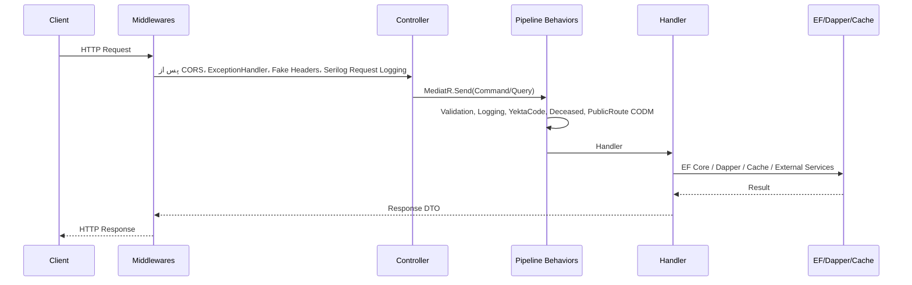
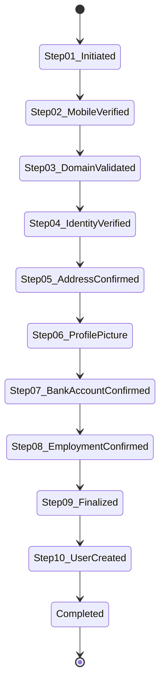

# جریان درخواست‌ها و State Machines

این سند، **نقشه‌ی کامل جریان درخواست‌ها** در سیستم پذیرش را ارائه می‌کند؛ از ورود درخواست HTTP تا اجرای Handler و تعامل با لایه داده. همچنین مهم‌ترین State Machine‌های عملیاتی (پذیرش، احراز هویت، مسدودی) در یک نگاه مستند شده‌اند.

---

## 🎯 هدف و دامنه
- شفاف‌سازی مراحل عبور هر درخواست از لایه‌های **Middleware → Controller → MediatR Pipeline → Handler → Data Access**
- ارائه دید واحد از **جریان‌های بحرانی**: احراز هویت، ویزارد تشکیل پرونده، مسدودی دانشجو
- مرجع مرزبانی برای **اشکال‌زدایی** و **پایش** (Observability)

---

## 1. خط لوله عمومی درخواست HTTP

### 1.1 نمای کلی

### 1.2 لایه Middleware (Csis.Admission.WebApi)
- **Exception Handling**: `UseExceptionHandler` + Exception Handlers ثبت‌شده در `AddExceptionHandlers`
- **امنیت سطح مسیر**:
  - `UseAuthentication` / `UseAuthorization`
  - **Digest Authentication** برای Swagger (`/swagger`) و Health (`/_health`)
  - **CORS Policy** مبتنی بر `CorsOptions`
- **Logging & Observability**:
  - Serilog (`UseSerilogRequestLogging` در صورت فعال بودن)
  - Scope‌های Log: `UseUserIdLogScope`, `UseIpAddressLogScope`, `UseUserAgentLogScope`
- **سخت‌گیری سربرگ‌ها**: `UseFakeXPoweredByHeader`، `UseFakeServerHeader`
- **پیکربندی پویا**: `GlobalOptions` برای `RunBackgroundServices`, `AllowFileUpload`, `IsDevelopment`

### 1.3 MediatR Pipeline Behaviors (Application/Common/Behaviors)
- **ValidationBehavior**: اجرای FluentValidation برای Commands/Queries
- **LoggingBehavior**: TraceId + مدت زمان اجرا
- **YektaCodeValidationBehavior**: کنترل یکتایی کدها
- **DeceasedValidationBehavior**: جلوگیری از عملیات روی افراد متوفی
- **PublicRouteCodmBehavior**: مدیریت CODM برای روت‌های عمومی

### 1.4 Data Access و Side Effects
- **EF Core**: `AppDbContext` + 92 `EntityConfiguration`
- **Dapper**: `AppDapperContext` + ~90 Stored Procedure
- **Cache**: `IMemoryCacheService`، `ICacheService` (Sliding/Absolute Expiration)
- **External Services**: وب‌سرویس ثبت احوال، پیامک OTP، سرویس فایل، IdentityServer
- **Transactions**: مدیریت در Handler یا Repository (EF) + هم‌زمانی با Dapper در عملیات خواندن/نوشتن

---

## 2. جریان احراز هویت و نشست

### 2.1 ورود (Student/Employee)
- **Trigger**: `LoginCommand` (کارمند/دانشجو) یا `LoginStudentCommand` (دانشجو + کپچا)
- **Flow**:
  1. ValidationBehavior → بررسی کپچا/OTP (برای دانشجو)
  2. احراز هویت در IdentityServer و تولید Access/Refresh Token
  3. ثبت لاگ امنیتی (موفق/ناموفق)
  4. بازگشت `LoginResultDto` شامل نقش‌ها و مدت اعتبار
- **خطاهای متداول**: InvalidCaptcha، InvalidOtpCode، AccountLocked

### 2.2 تمدید نشست
- **Trigger**: `RefreshTokenCommand`
- **Flow**:
  1. اعتبارسنجی Refresh Token و Fingerprint
  2. ابطال Refresh Token قبلی (در صورت نیاز)
  3. صدور Access Token جدید
  4. بروزرسانی `LastLogin` و لاگ رویداد

### 2.3 قواعد امنیتی مشترک
- اجباری بودن **HTTPS** (`UseHttpsRedirection`)
- **Rate Limiting/Throttling** در لایه API Gateway یا Reverse Proxy (خارج از این سرویس)
- **CORS محدود** بر اساس محیط

---

## 3. جریان ویزارد تشکیل پرونده (10 مرحله)

### 3.1 نمای جریان
- **Triggers اصلی**: `CreateAdmissionCaseStep01InitiateCommand` تا `CreateAdmissionCaseStep10CreateUserCommand`
- **Actors**: دانشجو (Self-Service) + سامانه ثبت احوال + سامانه پیامک + بانک
- **Side Effects**: ایجاد/به‌روزرسانی `AdmissionCase`, ثبت OTP, ذخیره تصویر، ثبت حساب بانکی

### 3.2 نقاط کنترل هر مرحله
- **Step01 Initiate**: تولید کپچا، ثبت درخواست اولیه، ذخیره TraceId
- **Step02 Mobile**: ارسال/تایید OTP، Rate Limit ارسال پیامک
- **Step03 Domain Validation**: بررسی حوزه/واحد مجاز برای پذیرش
- **Step04 Identity**: استعلام ثبت احوال + تأیید کاربر
- **Step05 Address**: دریافت آدرس با کدپستی (Dapper) و تأیید
- **Step06 Picture**: بارگذاری + AI Face Recognition
- **Step07 Bank Account**: اعتبارسنجی شماره شبا و مالکیت
- **Step08 Employment**: ثبت وضعیت اشتغال/حقوق
- **Step09 Finalize**: فراخوانی SP `SetNewStudent` و قفل‌کردن پرونده
- **Step10 Create User**: ایجاد کاربر در IdentityServer و فعال‌سازی پرونده

### 3.3 خطاها و بازیابی
- **Idempotency**: استفاده از `RequestId` در مراحل حساس (OTP, Address)
- **تلاش مجدد محدود** برای فراخوانی سرویس‌های بیرونی (OTP, WSM)
- **بازگردانی منطقی**: در صورت خطا در Step09/Step10، پرونده در حالت Draft باقی می‌ماند تا کارمند مداخله کند

---

## 4. جریان مسدودی/رفع مسدودی دانشجو

### 4.1 مسدودی
- **Trigger**: `CreateStudentBlockServiceCommand`
- **Flow**:
  1. ValidationBehavior → بررسی وجود پرونده فعال
  2. ثبت دلیل و محدوده مسدودی (Feature BlockServices)
  3. اعمال محدودیت بر سرویس‌های وابسته (بر اساس `StudentBlocks` table)
  4. اعلان به دانشجو (SMS/Notification)

### 4.2 رفع مسدودی
- **Trigger**: `CreateStudentUnblockServiceCommand` / `UnblockStudentServiceCommand`
- **Flow**:
  1. کنترل مجوز کاربر صادرکننده
  2. ثبت تاریخ رفع و دلیل
  3. آزادسازی سرویس‌های وابسته و بروزرسانی Cache

### 4.3 نقاط کلیدی پایش
- لاگ سطح Warning برای مسدودی‌های تکراری
- ردیابی حسابرسی برای `CreatedBy`, `ReasonId`, `ExpiresAt`
- معیار سلامت: تعداد مسدودی فعال به تفکیک سرویس

---

## 5. پایش سلامت و عملیات پشتیبانی
- **Health Checks**: مسیر `/_health` با Digest Auth؛ شامل پایش DB، Cache، External Services
- **Logging**: ارسال اختیاری به ElasticSearch DataStream (`logs/<app>-<yyyyMM>/<env>`)
- **Background Services** (در صورت فعال بودن GlobalOptions):
  - اجرای Seederها در نخستین درخواست غیر-Swagger
  - پردازش‌های دوره‌ای (مانند پاک‌سازی OTP/Cache) – وابسته به تنظیمات
- **دیباگ سریع**: TraceId در پاسخ‌ها + LogContext

---

## 6. ماتریس تطبیق Request → Handler → Data Access

| دامنه | Request | Handler (Command/Query) | Data Access | خروجی |
|-------|---------|-------------------------|-------------|-------|
| احراز هویت | POST /auth/login | `LoginCommand` / `LoginStudentCommand` | IdentityServer + Cache | Access/Refresh Token |
| تمدید نشست | POST /auth/refresh | `RefreshTokenCommand` | IdentityServer | Token جدید |
| تشکیل پرونده | POST /case-filings/steps/* | `CreateAdmissionCaseStep01-10*` | EF + Dapper (SPها) | `AdmissionCase` به‌روزشده |
| مسدودی | POST /blocks | `CreateStudentBlockServiceCommand` | EF (`StudentBlocks`) | مسدودی فعال |
| رفع مسدودی | POST /blocks/unblock | `UnblockStudentServiceCommand` | EF + Cache | مسدودی غیرفعال |

---

## 7. چک‌لیست طراحی جریان‌ها
- [x] تعریف ورودی/خروجی هر مرحله و ValidationBehavior
- [x] ثبت TraceId و Scope برای Observability
- [x] پوشش خطاهای شبکه‌ای سرویس‌های بیرونی (تلاش مجدد/Timeout)
- [x] تفکیک مسئولیت بین Handler (منطق) و Repository/Services (داده/خدمات بیرونی)
- [x] استفاده از Cache برای درخواست‌های idempotent (OTP، آدرس)
- [x] مستندسازی State Machine و مسیرهای Alternate/Exception

---

**آخرین بروزرسانی**: 2024-12-22

