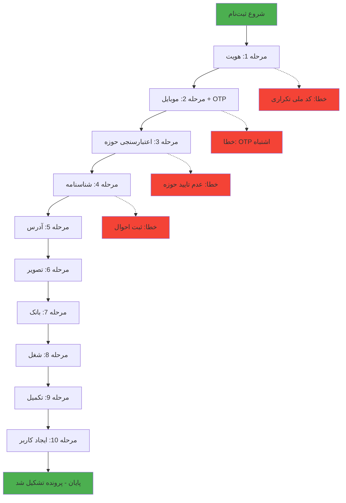
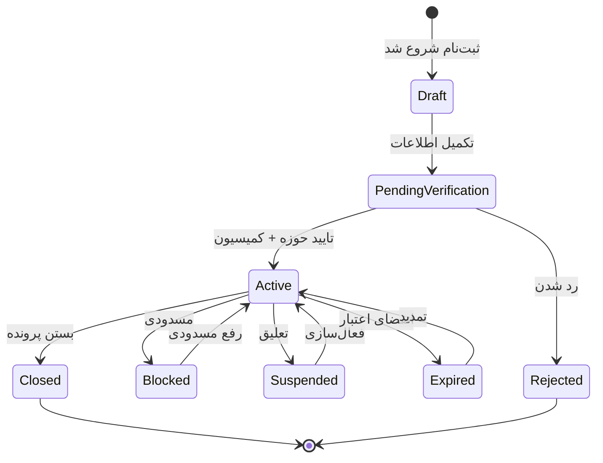
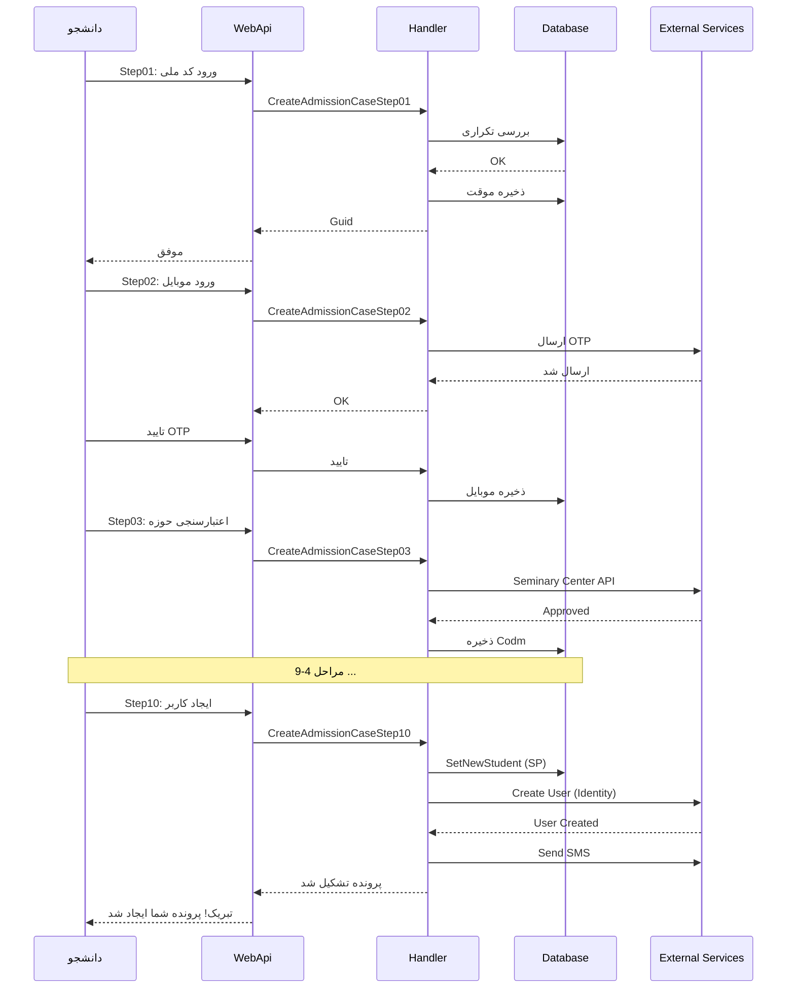

<div dir="rtl">

# کاتالوگ Use Cases - سیستم پذیرش

## مقدمه

این سند شامل **تمامی Use Case های** سیستم پذیرش است که از تحلیل Features، Controllers، Services و Stored Procedures استخراج شده‌اند.

## فرمت استاندارد هر Use Case

```markdown
### UC-XXX: نام فارسی | Technical Name

**هدف کسب‌وکار**: توضیح مختصر

**Actor(s)**: 
- نقش کاربر (Student/Employee/Admin/System)
- سطح دسترسی

**Trigger(s)**:
- HTTP: `METHOD /api/endpoint`
- Command/Query: `ClassName`

**Main Flow**:
1. مرحله 1
2. مرحله 2
...

**Alternate Flows**: 
- سناریوهای جایگزین

**Exception Flows**:
- خطاها و استثناها

**Business Rules**:
- قانون 1 → محل پیاده‌سازی
- قانون 2 → محل پیاده‌سازی

**Data Access**:
- EF: Entities
- Dapper: SPs

**Side Effects**:
- نوتیفیکیشن، SMS، Email، Event، Audit Log

**Dependencies**:
- Internal: Features, Services
- External: APIs

**Files**:
- Command/Query: مسیر فایل
- Handler: مسیر فایل
- Controller: مسیر فایل
```

---

## دسته‌بندی Use Cases

### 📊 خلاصه آماری

| دسته | تعداد UC | اولویت |
|------|---------|--------|
| احراز هویت | 5 | بحرانی ⚠️ |
| مدیریت دانشجو | 30 | بحرانی ⚠️ |
| تشکیل پرونده | 12 | بحرانی ⚠️ |
| مدیریت تکفل | 15 | بحرانی ⚠️ |
| رویدادهای خانوادگی | 8 | مهم |
| فعالیت‌های علمی | 12 | متوسط |
| فعالیت‌های فرهنگی | 10 | متوسط |
| مسکن و هدفمندی | 6 | مهم |
| کمیسیون | 5 | مهم |
| خدمات و مسدودی | 6 | بحرانی ⚠️ |
| گزارش‌گیری | 8 | مهم |
| داده‌های پایه | 15 | پایه |
| **جمع کل** | **132** | - |

---

## 🔐 دسته 1: احراز هویت و دسترسی (Authentication & Authorization)

### UC-001: ورود کارمند به سیستم | Employee Login

**هدف کسب‌وکار**: احراز هویت کارمند و صدور توکن دسترسی

**Actor(s)**: 
- کارمند سیستم (Employee)
- سطح دسترسی: Public (قبل از ورود)

**Trigger(s)**:
- HTTP: `POST /api/auth/login`
- Command: `LoginCommand`

**Main Flow**:
1. کارمند نام کاربری و رمز عبور را وارد می‌کند
2. سیستم به Identity Server درخواست احراز هویت می‌دهد
3. Identity Server اعتبارسنجی می‌کند
4. در صورت موفقیت، JWT Token صادر می‌شود
5. Refresh Token برای تمدید دسترسی صادر می‌شود
6. اطلاعات کاربر و نقش‌ها در Token قرار می‌گیرد

**Exception Flows**:
- نام کاربری یا رمز عبور اشتباه → `401 Unauthorized`
- Identity Server در دسترس نیست → `503 Service Unavailable`

**Business Rules**:
- ✅ رمز عبور باید حداقل 8 کاراکتر باشد → `LoginCommandValidator`
- ✅ بعد از 5 بار ورود ناموفق، حساب قفل می‌شود → Identity Server
- ✅ Token معتبر برای 1 ساعت است → `IdentityServerOptions`

**Data Access**:
- External: Identity Server API

**Side Effects**:
- Audit Log: ثبت ورود موفق/ناموفق
- Session: ایجاد Session کاربر

**Dependencies**:
- External: `ICsisIdentityServerService`

**Files**:
- Command: `/Features/Auth/Commands/LoginCommand.cs`
- Validator: `/Features/Auth/Validators/LoginCommandValidator.cs`
- Controller: `/Controllers/AuthController.cs` (احتمالی)

---

### UC-002: ورود دانشجو به سیستم | Student Login

**هدف کسب‌وکار**: احراز هویت دانشجو با کد مرکز و رمز عبور

**Actor(s)**: 
- دانشجو (Student)
- سطح دسترسی: Public

**Trigger(s)**:
- HTTP: `POST /api/auth/student/login`
- Command: `LoginStudentCommand`

**Main Flow**:
1. دانشجو کد مرکز (Codm) و رمز عبور را وارد می‌کند
2. سیستم اعتبارسنجی می‌کند
3. بررسی وضعیت پرونده (فعال/مسدود)
4. صدور JWT Token
5. ارسال کد OTP به موبایل (اختیاری - بسته به تنظیمات)

**Business Rules**:
- ✅ کد مرکز باید عدد 8 رقمی باشد
- ✅ پرونده نباید مسدود باشد → `CaseBlock`
- ✅ دانشجو باید حداقل یک بار توسط کارمند فعال شده باشد

**Data Access**:
- EF: `Student`, `StudentSummary`
- Dapper: `GetStudentInfoV4`

**Files**:
- Command: `/Features/Auth/Commands/LoginStudentCommand.cs`

---

### UC-003: تمدید توکن دسترسی | Refresh Token

**هدف کسب‌وکار**: تمدید Token بدون نیاز به ورود مجدد

**Trigger(s)**:
- HTTP: `POST /api/auth/refresh`
- Command: `RefreshTokenCommand`

**Main Flow**:
1. ارسال Refresh Token
2. اعتبارسنجی Refresh Token
3. صدور JWT جدید
4. صدور Refresh Token جدید

**Business Rules**:
- ✅ Refresh Token معتبر برای 30 روز است
- ✅ هر Refresh Token فقط یک بار قابل استفاده است

**Files**:
- Command: `/Features/Auth/Commands/RefreshTokenCommand.cs`

---

### UC-004: تولید و ارسال کد OTP | Generate OTP

**هدف کسب‌وکار**: ارسال کد یکبار مصرف برای تایید موبایل

**Trigger(s)**:
- داخلی از CaseFilings Step 02

**Main Flow**:
1. دریافت شماره موبایل
2. تولید کد 6 رقمی تصادفی
3. ذخیره کد با Expiration (5 دقیقه)
4. ارسال پیامک حاوی کد

**Business Rules**:
- ✅ کد معتبر برای 5 دقیقه است
- ✅ حداکثر 3 بار در روز برای هر موبایل
- ✅ کد باید 6 رقمی باشد

**Data Access**:
- Dapper: `GenerateOtpCode`

**Side Effects**:
- SMS: ارسال پیامک

---

### UC-005: خروج از سیستم | Logout

**هدف کسب‌وکار**: پایان Session کاربر

**Main Flow**:
1. ابطال Token سمت Client
2. پاک کردن Session (اگر Redis استفاده شود)

---

## 👨‍🎓 دسته 2: مدیریت دانشجو (Student Management)

### UC-010: مشاهده اطلاعات کامل دانشجو | Get Student Full Info

**هدف کسب‌وکار**: نمایش اطلاعات جامع دانشجو شامل شناسنامه‌ای، پرونده، آدرس، تماس، بانکی

**Actor(s)**: 
- کارمند (با دسترسی مشاهده)
- دانشجو (فقط اطلاعات خود)

**Trigger(s)**:
- HTTP: `GET /api/students/{codm}`
- Query: `GetStudentInfoByCodmQuery`

**Main Flow**:
1. دریافت Codm
2. بررسی دسترسی (آیا کاربر مجاز به مشاهده است؟)
3. دریافت اطلاعات از Dapper SP
4. Map به DTO
5. ثبت لاگ مشاهده

**Business Rules**:
- 🔐 کارمند فقط به دانشجویان شعبه خود دسترسی دارد
- 🔐 دانشجو فقط اطلاعات خود را می‌بیند
- 📊 لاگ مشاهده ثبت می‌شود → `EmployeeViewStudentLog`

**Data Access**:
- Dapper: `GetStudentInfoV4`
- EF: `EmployeeViewStudentLog` (insert)

**Side Effects**:
- Audit: ثبت لاگ مشاهده

**Files**:
- Query: `/Features/Students/Iranian/Queries/GetStudentInfoByCodmQuery.cs`

---

### UC-011: بروزرسانی اطلاعات شناسنامه‌ای دانشجو | Update Student Identity

**هدف کسب‌وکار**: بروزرسانی کد ملی، تاریخ تولد، مذهب دانشجو با اعتبارسنجی از ثبت احوال

**Actor(s)**: 
- کارمند ارشد (Senior Personnel) - برای تغییر کد ملی
- کارمند عادی - برای سایر موارد

**Trigger(s)**:
- HTTP: `PUT /api/students/{codm}/identity`
- Command: `UpdateStudentBirthCertCommand`

**Main Flow**:
1. دریافت Codm و اطلاعات جدید (کد ملی، تاریخ تولد، مذهب)
2. بررسی دسترسی کاربر
3. **بررسی تکراری نبودن کد ملی**
4. **استعلام از ثبت احوال** (WSM Service)
5. در صورت تطابق، بروزرسانی در دیتابیس
6. فراخوانی SP

**Business Rules**:
- ⚠️ **فقط Senior Personnel** می‌تواند کد ملی و تاریخ تولد را تغییر دهد
- ✅ کد ملی باید منحصر به فرد باشد
- ✅ کد ملی و تاریخ تولد باید با ثبت احوال تطابق داشته باشد
- ✅ اگر کد ملی تکراری بود → Exception

**Data Access**:
- EF: `StudentSummary` (check duplicate)
- Dapper: `SetStudentBirthCertInfo`

**External Integration**:
- **WSM Service**: اعتبارسنجی از ثبت احوال

**Side Effects**:
- Audit Log: ثبت تغییر
- Notification: اطلاع‌رسانی به دانشجو

**Exception Flows**:
- کد ملی تکراری → `"این کد ملی قبلاً در سامانه ثبت شده است"`
- عدم تطابق با ثبت احوال → `"کد ملی یا تاریخ تولد وارد شده در ثبت احوال یافت نشد"`
- عدم دسترسی → `"شما مجوز لازم برای تغییر کد ملی و تاریخ تولد را ندارید"`

**Files**:
- Command: `/Features/Students/Iranian/Commands/UpdateStudentBirthCertCommand.cs`
- SP: `SetStudentBirthCertInfo`

---

### UC-012: سینک اطلاعات با ثبت احوال | Sync with Civil Registry

**هدف کسب‌وکار**: بروزرسانی خودکار اطلاعات از ثبت احوال

**Trigger(s)**:
- Command: `SyncStudentBirthCertByCodmCommand`
- Command: `SyncStudentBirthCertCommand` (by national code)

**Main Flow**:
1. فراخوانی WSM Service
2. دریافت اطلاعات کامل از ثبت احوال
3. بروزرسانی دیتابیس

**Data Access**:
- Dapper: `SetStudentWithSabtAhvalData`

---

### UC-013: بروزرسانی تصویر پروفایل | Update Profile Picture

**هدف کسب‌وکار**: آپلود و بروزرسانی تصویر پرسنلی دانشجو

**Trigger(s)**:
- Command: `UpdateStudentProfilePictureCommand`

**Main Flow**:
1. آپلود فایل تصویر
2. اعتبارسنجی فرمت و سایز
3. آپلود به FileManagement Service
4. ذخیره URL در دیتابیس
5. ذخیره تاریخچه تصویر

**Business Rules**:
- ✅ فرمت: JPG, PNG
- ✅ حداکثر سایز: 2MB
- ✅ نسبت ابعاد: 1:1 (مربعی)

**Data Access**:
- Dapper: `SetStudentPictureV4`
- EF: `PictureHistory`

**External**:
- File Management Service

**Files**:
- Command: `/Features/Students/Iranian/Commands/UpdateStudentProfilePictureCommand.cs`

---

### UC-014: تمدید پرونده دانشجو | Extend Student Case

**هدف کسب‌وکار**: تمدید اعتبار پرونده دانشجو

**Trigger(s)**:
- Command: `StudentExtensionCaseCommand`

**Main Flow**:
1. دریافت Codm
2. بررسی شرایط تمدید
3. محاسبه تاریخ جدید
4. بروزرسانی تاریخ اعتبار

**Business Rules**:
- ✅ تمدید خودکار: بر اساس قوانین
- ✅ تمدید دستی: نیاز به تایید کمیسیون

**Data Access**:
- Dapper: `SetStudentCaseValidityDate`, `SetStudentCaseValidityDateAuto`

---

### UC-015: مسدودی پرونده دانشجو | Block Student Case

**هدف کسب‌وکار**: مسدود کردن پرونده به دلایل مختلف

**Trigger(s)**:
- Command: `CreateStudentCaseBlockCommand`
- Command: `CreateStudentCaseBlockRequestCommand` (درخواست مسدودی)

**Main Flow**:
1. ثبت درخواست مسدودی
2. تعیین دلیل
3. تایید توسط مسئول
4. اعمال مسدودی

**Business Rules**:
- ⚠️ پرونده مسدود → عدم دسترسی به خدمات
- ✅ نیاز به دلیل مسدودی
- ✅ نیاز به تایید مسئول

**Files**:
- Command: `/Features/CaseBlock/Commands/CreateStudentCaseBlockCommand.cs`

---

### UC-016: رفع مسدودی پرونده | Unblock Student Case

**Trigger(s)**:
- Command: `CreateStudentCaseUnblockCommand`

**Main Flow**:
1. بررسی شرایط رفع مسدودی
2. تایید مسئول
3. رفع مسدودی

---

### UC-017: مشاهده خلاصه پرونده | Get Case Summary

**Trigger(s)**:
- Query: `GetStudentSummaryCaseByCodmQuery`

**Data Access**:
- Dapper: `GetStudentCaseInfoV4`

---

### UC-018: جستجوی پیشرفته دانشجو | Student Advanced Search

**Trigger(s)**:
- Query: `StudentAdvancedSearchQuery`

**Main Flow**:
1. دریافت فیلترها (نام، کد ملی، شعبه، وضعیت، ...)
2. ساخت Query پویا
3. Pagination
4. مرتب‌سازی

**Data Access**:
- EF: `Student`, `StudentSummary` با Query پیچیده

---

### UC-019: بروزرسانی شماره موبایل دانشجو | Update Student Mobile

**Trigger(s)**:
- Command: `UpdateStudentMobileCommand`
- Command: `UpdateStudentMobileRequestCommand`

**Main Flow**:
1. ارسال کد OTP به موبایل جدید
2. تایید کد OTP
3. بروزرسانی موبایل
4. لاگ تغییر

**Data Access**:
- Dapper: `SetStudentMobileV4`

---

### UC-020: بروزرسانی شماره حساب بانکی | Update Bank Account

**Trigger(s)**:
- Command: `UpdateStudentBankAccountCommand`

**Main Flow**:
1. دریافت شماره حساب/کارت جدید
2. **بررسی تکراری نبودن**
3. اعتبارسنجی IBAN/شماره کارت
4. بروزرسانی

**Business Rules**:
- ✅ شماره حساب نباید تکراری باشد
- ✅ اعتبارسنجی فرمت IBAN

**Data Access**:
- Dapper: `CheckDuplicateBankAccountNumberV4`, `SetStudentBankAccountNumberV4`

---

### UC-021: مشاهده اطلاعات شهریه | Get Tuition Info

**Trigger(s)**:
- Query: `GetStudentShahriehInfoByCodmQuery`

**Data Access**:
- Dapper: `GetShahriehData`, `GetShahriehPayments`

---

### UC-022: مشاهده تاریخچه مسکن | Get Housing History

**Trigger(s)**:
- Query: `GetStudentHouseHistoryByCodmQuery`

**Data Access**:
- Dapper: `GetHouseHistoryV4`

---

### UC-023: بروزرسانی آدرس دانشجو | Update Student Address

**Trigger(s)**:
- Command: `CreateOrUpdateStudentAddressCommand`
- Command: `CreateOrUpdateStudentAddressRequestCommand`

**Main Flow**:
1. ثبت آدرس جدید
2. **نیاز به تایید 2 طلبه** (در صورت تغییر شهر)
3. تایید آدرس
4. فعال‌سازی آدرس

**Business Rules**:
- ⚠️ تغییر شهر آدرس نیاز به تایید 2 طلبه دارد

**Data Access**:
- Dapper: `CheckAddressApproveV4`
- EF: `Address`

**Files**:
- Command: `/Features/Addresses/Commands/CreateOrUpdateStudentAddressCommand.cs`

---

## 📋 دسته 3: تشکیل پرونده (Case Filing) - Wizard 10 مرحله‌ای

### UC-030: تشکیل پرونده دانشجوی جدید | Student Registration Wizard

**هدف کسب‌وکار**: ثبت‌نام و تشکیل پرونده دانشجوی جدید از طریق یک فرآیند 10 مرحله‌ای

**Actor(s)**: 
- دانشجو (Student) - ثبت‌نام خودخدمت
- کارمند (Employee) - ثبت‌نام توسط کارمند

**Flow Diagram**:



---

#### UC-030-01: مرحله 1 - ورود اطلاعات هویتی

**Trigger**: `CreateAdmissionCaseStep01IdentityCommand`

**Main Flow**:
1. ورود کد ملی، نام، نام خانوادگی
2. بررسی تکراری نبودن کد ملی
3. ایجاد `AdmissionCaseUser` موقت (با Guid)
4. ذخیره اطلاعات اولیه

**Business Rules**:
- ✅ کد ملی نباید تکراری باشد
- ✅ کد ملی باید 10 رقمی باشد

---

#### UC-030-02: مرحله 2 - تایید موبایل

**Trigger**: `CreateAdmissionCaseStep02MobileCommand`

**Main Flow**:
1. ورود شماره موبایل
2. ارسال کد OTP
3. تایید کد OTP
4. ذخیره موبایل

**Business Rules**:
- ✅ شماره موبایل باید 11 رقمی باشد
- ✅ کد OTP معتبر برای 5 دقیقه

**Data Access**:
- Dapper: `GenerateOtpCode`

---

#### UC-030-03: مرحله 3 - اعتبارسنجی از مرکز حوزوی

**Trigger**: `CreateAdmissionCaseStep03ValidateForRegistrationCommand`

**Main Flow**:
1. استعلام از مرکز حوزوی
2. بررسی وضعیت طلبگی
3. دریافت کد مرکز (Codm) - اگر قبلاً ثبت شده

**Business Rules**:
- ⚠️ **الزامی**: دانشجو باید در مرکز حوزوی تایید شده باشد
- ✅ اگر قبلاً پرونده داشته، کد مرکز بازیابی می‌شود

**Data Access**:
- Dapper: `ValidateStudentStatusForRegisterationV4`

**External**:
- Seminary Center API

---

#### UC-030-04: مرحله 4 - تکمیل اطلاعات شناسنامه‌ای

**Trigger**: `CreateAdmissionCaseStep04ValidateIdentityCommand`

**Main Flow**:
1. ورود تاریخ تولد، محل تولد، مذهب
2. **استعلام از ثبت احوال**
3. تایید اطلاعات
4. ذخیره

**Data Access**:
- External: Civil Registry API (WSM)

---

#### UC-030-05: مرحله 5 - ثبت آدرس

**Trigger**: `CreateAdmissionCaseStep05ConfirmAddressByPostalCodeCommand`

**Main Flow**:
1. ورود کدپستی
2. دریافت آدرس از سرویس
3. تایید/ویرایش آدرس
4. ذخیره

**Query**: `CreateAdmissionCaseStep05GetAddressByPostalCodeQuery`

---

#### UC-030-06: مرحله 6 - آپلود تصویر

**Trigger**: `CreateAdmissionCaseStep06PictureCommand`

**Main Flow**:
1. آپلود تصویر پرسنلی
2. اعتبارسنجی فرمت و سایز
3. آپلود به FileManagement
4. ذخیره URL

---

#### UC-030-07: مرحله 7 - اطلاعات بانکی

**Trigger**: `CreateAdmissionCaseStep07ConfirmBankAccountInformationCommand`

**Main Flow**:
1. ورود شماره حساب/کارت
2. بررسی تکراری نبودن
3. اعتبارسنجی فرمت
4. ذخیره

---

#### UC-030-08: مرحله 8 - اطلاعات شغلی

**Trigger**: `CreateAdmissionCaseStep08ConfirmEmploymentCommand`

**Main Flow**:
1. ورود وضعیت اشتغال
2. اگر شاغل: ورود جزئیات شغل
3. ذخیره

---

#### UC-030-09: مرحله 9 - تکمیل اطلاعات

**Trigger**: `CreateAdmissionCaseStep09CompleteInformationCaseFilingCommand`

**Main Flow**:
1. بررسی تکمیل بودن همه مراحل
2. نهایی کردن اطلاعات
3. فراخوانی SP ثبت پرونده

**Data Access**:
- Dapper: `SetNewStudent`

---

#### UC-030-10: مرحله 10 - ایجاد حساب کاربری

**Trigger**: `CreateAdmissionCaseStep10CreateUserCommand`

**Main Flow**:
1. ایجاد User در Identity Server
2. تعیین رمز عبور اولیه
3. ارسال اطلاعات به دانشجو (SMS/Email)
4. فعال‌سازی پرونده

**Side Effects**:
- User Creation در Identity Server
- SMS: ارسال اطلاعات کاربری

**Files**:
- Commands: `/Features/CaseFilings/Commands/Student/CreateAdmissionCaseStepXX*.cs`

---

## 👨‍👩‍👧‍👦 دسته 4: مدیریت افراد تحت تکفل (Dependent Management)

### UC-040: ثبت تکفل جدید | Register New Dependent

**هدف کسب‌وکار**: ثبت فرد تحت تکفل برای دانشجو

**Actor(s)**: کارمند/دانشجو

**Trigger(s)**:
- Command: `CreateDependentCommand`

**Main Flow**:
1. ورود اطلاعات تکفل (نام، نسبت، کد ملی، ...)
2. اعتبارسنجی
3. ثبت در دیتابیس
4. ایجاد پرونده تکفل

**Business Rules**:
- ✅ تکفل باید یکی از روابط مجاز باشد (همسر، فرزند، والدین، ...)
- ✅ کد ملی نباید تکراری باشد

**Data Access**:
- Dapper: `SetNewDependent`
- EF: `Dependent`, `DependentCase`

---

### UC-041: فعال کردن پرونده تکفل | Activate Dependent Case

**Trigger(s)**:
- Command: `SetDependentActiveCommand`

**Main Flow**:
1. تعیین دلیل فعال‌سازی
2. تایید شرایط
3. فعال‌سازی

**Data Access**:
- Dapper: `SetDependentActive`

---

### UC-042: غیرفعال کردن پرونده تکفل | Deactivate Dependent Case

**Trigger(s)**:
- Command: `DeactivateDependentCommand`

**Main Flow**:
1. تعیین دلیل غیرفعال‌سازی
2. غیرفعال کردن پرونده

**Business Rules**:
- دلایل غیرفعال‌سازی: ازدواج، طلاق، فوت، مستقل شدن

**Data Access**:
- Dapper: `DeActiveDependentV4`

---

### UC-043: بروزرسانی موبایل تکفل | Update Dependent Mobile

**Trigger(s)**:
- Command: `UpdateDependentMobileCommand`

**Data Access**:
- Dapper: `SetDependentMobileV4`

---

### UC-044: بروزرسانی حساب بانکی تکفل | Update Dependent Bank Account

**Trigger(s)**:
- Command: `UpdateDependentBankAccountCommand`

**Data Access**:
- Dapper: `SetDependentBankAccountNumberV4`

---

## 💍 دسته 5: رویدادهای خانوادگی (Family Events)

### UC-050: ثبت ازدواج طلبه (خواهر) | Register Student Marriage

**هدف کسب‌وکار**: ثبت تاریخ ازدواج برای طلاب خواهر

**Trigger(s)**:
- Command: `SetStudentSisterMarriageCommand`

**Data Access**:
- Dapper: `SetStudentSisterMarriage`

---

### UC-051: ثبت طلاق سرپرست | Register Student Divorce

**Trigger(s)**:
- Command: `SetStudentDivorceCommand`

**Data Access**:
- Dapper: `SetStudentDivorceV4`

---

### UC-052: ثبت ازدواج تکفل (فرزند) | Register Dependent Child Marriage

**هدف کسب‌وکار**: ثبت ازدواج فرزندان تحت تکفل - پرونده تکفل بسته می‌شود

**Business Rules**:
- ⚠️ **ازدواج فرزند → بستن خودکار پرونده تکفل**

**Data Access**:
- Dapper: `SetDependentChildMarriage`

---

### UC-053: ثبت ازدواج تکفل (همسر بیوه) | Register Dependent Spouse Marriage

**Business Rules**:
- ⚠️ **ازدواج همسر بیوه → بستن پرونده**

**Data Access**:
- Dapper: `SetDependentSpouseMarriage`

---

### UC-054: ثبت طلاق تکفل (همسر) | Register Dependent Spouse Divorce

**Business Rules**:
- ⚠️ **طلاق همسر → غیرفعال کردن پرونده تکفل**

**Data Access**:
- Dapper: `SetDependentSpouseDivorce`

---

### UC-055: ثبت طلاق تکفل (فرزند) | Register Dependent Child Divorce

**Business Rules**:
- ℹ️ طلاق فرزند → بدون تاثیر در وضعیت پرونده

**Data Access**:
- Dapper: `SetDependentChildDivorce`

---

### UC-056: ثبت بارداری | Register Pregnancy

**Trigger(s)**:
- Command: `CreatePregnancyCommand`

**Data Access**:
- EF: `Pregnancy`

---

## 🏫 دسته 6: فعالیت‌های علمی و فرهنگی

### UC-060: ثبت پژوهش | Register Research

**Trigger(s)**:
- Command: `CreateResearchCommand`

**Data Access**:
- EF: `Research`

---

### UC-061: ثبت نمره پژوهش | Register Research Grade

**Trigger(s)**:
- Command: `CreateResearchGradeCommand`

---

### UC-062: ثبت تدریس | Register Teaching

**Trigger(s)**:
- Command: `CreateTeachCommand`

---

### UC-063: ثبت نمره تدریس | Register Teaching Grade

**Trigger(s)**:
- Command: `CreateTeachGradeCommand`

---

### UC-064: ثبت تبلیغ | Register Preaching

**Trigger(s)**:
- Command: `CreatePreachCommand`

---

### UC-065: ثبت نمره تبلیغ | Register Preach Grade

**Trigger(s)**:
- Command: `CreatePreachGradeCommand`

---

### UC-066: ثبت فعالیت فرهنگی | Register Cultural Activity

**Trigger(s)**:
- Command: `CreateCulturalActivityCommand`

---

### UC-067: ثبت حفظ قرآن | Register Quran Memorization

**Trigger(s)**:
- Command: `CreateMemorizerCommand`

---

### UC-068: ثبت امام جماعت | Register Imam Jamaat

**Trigger(s)**:
- Command: `CreateImamJamaatCommand`

---

### UC-069: ثبت نقش‌آفرینی مذهبی | Register Religious Role

**Trigger(s)**:
- Command: `CreateReligiousRoleQuestionCommand`

**Data Access**:
- Dapper: `ValidateReligiousRoleV4`

---

## 🏠 دسته 7: مسکن و هدفمندی

### UC-070: محاسبه امتیاز هدفمندی | Calculate Targeting Score

**Trigger(s)**:
- Query: `GetTargetedScoreQuery`

**Data Access**:
- Dapper: `GetTargetedScoreInfoV4`, `GetSubsistenceTargetedScoreInfoV4`, `GetTarazAndLivelihoodTotalScoreAndTotalScore`

---

### UC-071: ثبت اطلاعات مسکن | Register Housing Info

**Trigger(s)**:
- Command: `CreateHousingAdmissionInfoCommand`

---

### UC-072: مشاهده تاریخچه مسکن | Get Housing History

**Trigger(s)**:
- Query: `GetStudentHouseHistoryByCodmQuery`

**Data Access**:
- Dapper: `GetHouseHistoryV4`

---

## 🔒 دسته 8: خدمات و مسدودی

### UC-080: مسدودی خدمت برای دانشجو | Block Student Service

**Trigger(s)**:
- Command: `CreateStudentBlockServiceCommand`

**Main Flow**:
1. انتخاب خدمت (کارت، پرداخت، مسکن، ...)
2. تعیین دلیل مسدودی
3. تایید
4. اعمال مسدودی

**Data Access**:
- Dapper: `SetStudentBlocked`

---

### UC-081: رفع مسدودی خدمت | Unblock Student Service

**Trigger(s)**:
- Command: `UnblockStudentServiceCommand`

**Data Access**:
- Dapper: `SetStudentUnBlocked`

---

### UC-082: مشاهده خدمات مسدود | Get Blocked Services

**Trigger(s)**:
- Query: `GetStudentBlockedServicesByCodmQuery`

**Data Access**:
- Dapper: `GetStudentBlockedService`, `GetDependentBlockedService`

---

## 📊 دسته 9: کمیسیون و تایید

### UC-090: مشاهده اطلاعات کمیسیون | Get Commission Info

**Trigger(s)**:
- Query: `GetStudentCommissionsInfoByCodmQuery`

**Data Access**:
- Dapper: `GetStudentCommission`, `GetCommissionForNewStudent`

---

### UC-091: بروزرسانی وضعیت کمیسیون | Update Commission Status

**Data Access**:
- Dapper: `SetCommissionStatus`

---

## 📈 دسته 10: گزارش‌گیری

### UC-100: تولید گزارش سفارشی | Build Custom Report

**Trigger(s)**:
- Command: `CreateReportBuilderCommand`

**Data Access**:
- EF: `ReportBuilder`

---

### UC-101: دریافت داده برای اجرای پرداخت | Get Payroll Data

**Trigger(s)**:
- Query: `GetDataForPayRunByCodmQuery`

**Data Access**:
- Dapper: `GetDataForPayRunByCodm`, `GetDataForPayRunByCodmList`, `GetDataForPayRunByStartEnd`

---

### UC-102: مشاهده لاگ‌های ممیزی | Get Audit Logs

**Trigger(s)**:
- Query: `GetStudentAdmissionAuditLogsByCodmQuery`

**Data Access**:
- Dapper: `GetStudentAuditLog`, `GetDependentAuditLog`

---

### UC-103: مشاهده آمار جداول | Get Table Record Counts

**Data Access**:
- Dapper: `GetTableRecordCountV4`

---

## 🗃️ دسته 11: داده‌های پایه (Master Data)

### UC-110: مدیریت تقسیمات کشوری | Manage Country Divisions

**Trigger(s)**:
- Command: `CreateTownCommand` → SP: `SetTown`
- Command: `CreateRuralCommand` → SP: `SetRural`
- Command: `CreatePortionCommand` → SP: `SetPortion`

---

### UC-111: بروزرسانی شعبه و نمایندگی | Update Branch & Agency

**Data Access**:
- Dapper: `UpdateBranchAndAgency`

---

### UC-112: دریافت لیست شهرها | Get Cities

**Trigger(s)**:
- Query: `GetCitiesQuery`

---

### UC-113: دریافت لیست استان‌ها | Get Provinces

**Trigger(s)**:
- Query: `GetProvincesQuery`

---

## 🔔 دسته 12: نوتیفیکیشن

### UC-120: ارسال نوتیفیکیشن | Send Notification

**Trigger(s)**:
- Command: `CreateNotificationCommand`

**Side Effects**:
- Background Job: `SendNotificationBackgroundService`
- SMS/Email/Push

---

## ⚙️ دسته 13: تنظیمات

### UC-130: مدیریت تنظیمات سیستم | Manage Settings

**Trigger(s)**:
- Command: `UpdateSettingCommand`
- Query: `GetSettingsQuery`

---

## 🎯 UC های کلیدی - State Machine

### State Machine: وضعیت پرونده



---

## نمودار Sequence: UC-030 تشکیل پرونده



---

## لینک‌ها به مستندات فایل‌محور

برای جزئیات بیشتر هر UC، به مستندات فایل‌های زیر مراجعه کنید:

### Authentication
- `/docs/files/Csis.Admission.Application/Features/Auth/Commands/LoginCommand.md`
- `/docs/files/Csis.Admission.Application/Features/Auth/Commands/LoginStudentCommand.md`

### Student Management
- `/docs/files/Csis.Admission.Application/Features/Students/Iranian/Commands/UpdateStudentBirthCertCommand.md`
- `/docs/files/Csis.Admission.Application/Features/Students/Iranian/Queries/GetStudentInfoByCodmQuery.md`

### Case Filing
- `/docs/files/Csis.Admission.Application/Features/CaseFilings/Commands/Student/CreateAdmissionCaseStep01IdentityCommand.md`
- ... (Step 02-10)

---

## خلاصه: Critical Use Cases

| UC ID | نام | اهمیت | پیچیدگی | وابستگی خارجی |
|-------|-----|-------|---------|---------------|
| UC-001 | ورود کارمند | ⚠️ بحرانی | پایین | Identity Server |
| UC-002 | ورود دانشجو | ⚠️ بحرانی | پایین | Identity Server |
| UC-011 | بروزرسانی هویت | ⚠️ بحرانی | بالا | Civil Registry |
| UC-015 | مسدودی پرونده | ⚠️ بحرانی | متوسط | - |
| UC-030 | تشکیل پرونده | ⚠️ بحرانی | خیلی بالا | Seminary, Civil, Identity |
| UC-052 | ازدواج تکفل | 🔶 مهم | متوسط | - |
| UC-070 | امتیاز هدفمندی | 🔶 مهم | بالا | - |
| UC-080 | مسدودی خدمت | ⚠️ بحرانی | متوسط | - |

---

این سند در ادامه با مستندسازی فایل‌به‌فایل تکمیل خواهد شد.

</div>
